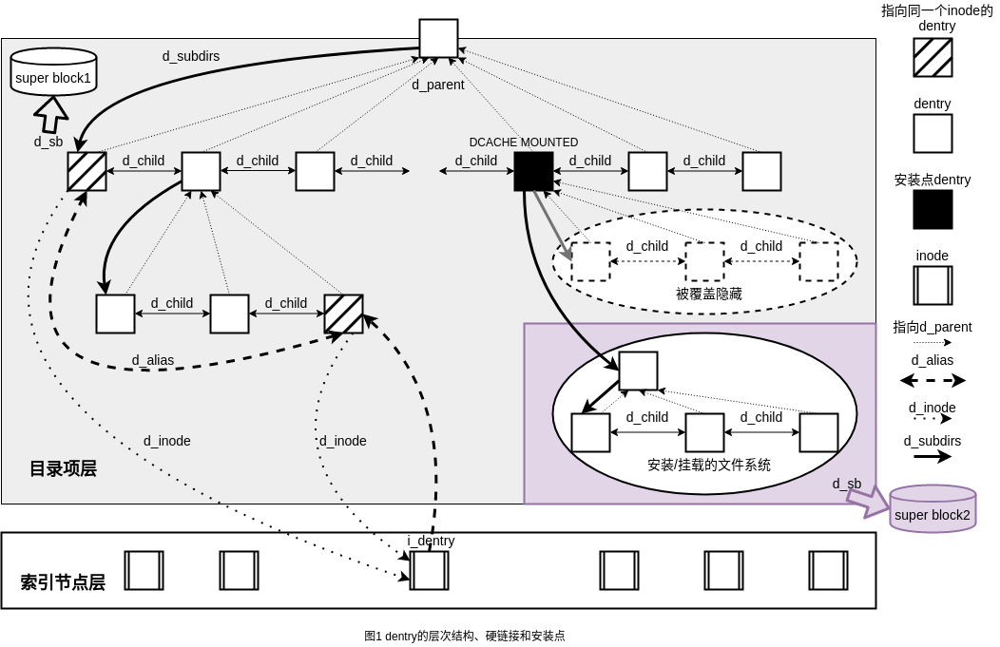
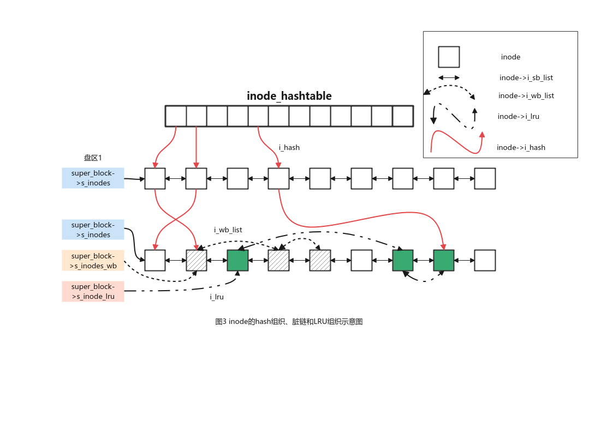

## 文件对象

对一个目录项打开多次产生多个文件对象，每个文件对象又可以由多个文件描述符索引用。文件对象没有直接的磁盘映射内容，所以也没有表示自己是否为脏的标记。

### 文件对象结构体

每一个被操作系统打开的磁盘文件都要在内存中建立一个file结构的文件对象。如下所示为file结构体定义：

```c
/*
 * VFS核心对象：文件对象结构体
 */
struct file {
    union {
        struct llist_node    fu_llist;
        struct rcu_head     fu_rcuhead;
    } f_u;
    /* f_path: 包含目录项信息和所属文件系统的挂载点信息 
     * f_path.mnt: 表示该file实例关联的文件所属文件系统的挂载点信息
     * f_path.dentry: 该文件的目录项信息，通过dentry可建立file实例与文件inode的联系，进而找到存放在磁盘上的真正的文件数据。
     */
    struct path        f_path;
    /* f_inode: 指向与该file实例关联的文件inode，一般情况下f_inode = f_path dentry->d_inode */
    struct inode        *f_inode;    /* cached value */
    /* f_op: 文件操作函数指针列表 */
    const struct file_operations    *f_op;

    /*
     * Protects f_ep, f_flags.
     * Must not be taken from IRQ context.
     */
    spinlock_t        f_lock;
    enum rw_hint        f_write_hint;
    /* f_count: 记录该文件的引用计数 */
    atomic_long_t        f_count;
    /* f_flags: 用户态打开文件时所用的flag */
    unsigned int         f_flags;
    /* f_mode: 用户态打开文件时所用的mode */
    fmode_t            f_mode;
    struct mutex        f_pos_lock;
    /* f_pos: 文件游标，即文件进行读写指针的当前位置 */
    loff_t            f_pos;
    /* f_owner: 文件属主的有关信息、同时也包含与信号传递的相关信息 */
    struct fown_struct    f_owner;
    /* f_cred: 指向打开该文件实例的进程cred(task_struct->cred)，保存了打开该文件实例的进程的相关权限 */
    const struct cred    *f_cred;
    /* f_ra: 文件预读状态 */
    struct file_ra_state    f_ra;

    u64            f_version;
#ifdef CONFIG_SECURITY
    void            *f_security;
#endif
    /* needed for tty driver, and maybe others */
    void            *private_data;

#ifdef CONFIG_EPOLL
    /* Used by fs/eventpoll.c to link all the hooks to this file */
    struct hlist_head    *f_ep;
#endif /* #ifdef CONFIG_EPOLL */
    /* f_mapping: 指向与文件相关的inode实例的地址空间映射，
     * 与文件的page cache有关，页缓存中保存以前访问过的文件数据 
     */
    struct address_space    *f_mapping;
    errseq_t        f_wb_err;
    errseq_t        f_sb_err; /* for syncfs */
} __randomize_layout
  __attribute__((aligned(4)));
```

文件对象是`VFS`层为进程打开一个文件时创建的，它调用`alloc_empty_file(int flags, const struct cred *cred)`函数分配新的file对象，然后根据打开的文件和相关进程填写各个成员。`alloc_empty_file`函数内部使用`kmem_cache_zalloc`从`filp_cachep`高速缓存中获得一个空闲文件对象，然后初始化各个字段。具体流程参见如下：

```c
/* Find an unused file structure and return a pointer to it.
 * Returns an error pointer if some error happend e.g. we over file
 * structures limit, run out of memory or operation is not permitted.
 *
 * Be very careful using this.  You are responsible for
 * getting write access to any mount that you might assign
 * to this filp, if it is opened for write.  If this is not
 * done, you will imbalance int the mount's writer count
 * and a warning at __fput() time.
 */
struct file *alloc_empty_file(int flags, const struct cred *cred)
    |——>__alloc_file(flags, cred);
            |——>kmem_cache_zalloc(filp_cachep, GFP_KERNEL);
```

文件对象的内存管理使用一个`filp_cache`的`slab`高速缓存(在`/proc/slabinfo`中显示为`filp`)。

```c
/* SLAB cache for file structures */
static struct kmem_cache *filp_cachep __read_mostly;
```

系统中允许的最大文件对象数目由`files_stat_struct`变量中的`max_files`字段中做出限制，如下代码所示。

```c
/* sysctl tunables... */
struct files_stat_struct files_stat = {
    .max_files = NR_FILE
};
```

上述限制可以通过`/proc/sys/fs/file-max`进行修改，超级用户不受此限制。

### 文件操作函数

每个文件系统都有自己的函数操作集合，因此内核打开一个文件时，将这些操作函数指针存放在`file->f_op(struct file_operations)`成员中，该结构体及其函数如下所示。

```c
struct file_operations {
    /* owner: 当文件系统以模块的形式插入系统时使用该成员，
     * 此时该成员指向内存中表示该模块的数据结构
     */
    struct module *owner;
    /* llseek: 用于更新偏移量指针(file->f_ops)
     * 将新位置的偏移量作为返回值，由系统调用lseek调用
     */
    loff_t (*llseek) (struct file *, loff_t, int);
    /* read: 同步的读给定文件的数据 */
    ssize_t (*read) (struct file *, char __user *, size_t, loff_t *);
    /* write: 同步的写数据到给定文件 */
    ssize_t (*write) (struct file *, const char __user *, size_t, loff_t *);
    ssize_t (*read_iter) (struct kiocb *, struct iov_iter *);
    ssize_t (*write_iter) (struct kiocb *, struct iov_iter *);
    int (*iopoll)(struct kiocb *kiocb, bool spin);
    int (*iterate) (struct file *, struct dir_context *);
    int (*iterate_shared) (struct file *, struct dir_context *);
    /* poll: 用于poll和select系统调用，实现同步的I/O多路复用 */
    __poll_t (*poll) (struct file *, struct poll_table_struct *);
    /* unlocked_ioctl：用来给设备文件发送命令参数对 
     * 相较于ioctl，该函数不需要BKL
     */
    long (*unlocked_ioctl) (struct file *, unsigned int, unsigned long);
    long (*compat_ioctl) (struct file *, unsigned int, unsigned long);
    /* mmap：用于指定的文件映射到指定的虚拟地址空间上
     * 包括裸设备内存映射到虚拟地址空间
     */
    int (*mmap) (struct file *, struct vm_area_struct *);
    unsigned long mmap_supported_flags;
    /* open：创建一个新的文件对象，并将它和相应的索引节点对象关联 */
    int (*open) (struct inode *, struct file *);
    int (*flush) (struct file *, fl_owner_t id);
    int (*release) (struct inode *, struct file *);
    /* fsync：将给定文件的所有被缓存数据写回磁盘 */
    int (*fsync) (struct file *, loff_t, loff_t, int datasync);
    int (*fasync) (int, struct file *, int);
    /* lock：给指定文件上锁，对文件的并发访问进行互斥保护 */
    int (*lock) (struct file *, int, struct file_lock *);
    ssize_t (*sendpage) (struct file *, struct page *, int, size_t, loff_t *, int);
    /* get_unmapped_area：获取未使用的虚拟地址空间 */
    unsigned long (*get_unmapped_area)(struct file *, unsigned long,    unsigned long, unsigned long, unsigned long);
    int (*check_flags)(int);
    int (*flock) (struct file *, int, struct file_lock *);
    /* splice_write
     * splice_read
     * 用于从管道向文件传输数据或者从文件向管道写数据
     * 上述两个函数通过去除在内核空间和用户空间之间的内存复制开销来提高性能
     */
    ssize_t (*splice_write)(struct pipe_inode_info *, struct file *, loff_t *, size_t, unsigned int);
    ssize_t (*splice_read)(struct file *, loff_t *, struct pipe_inode_info *, size_t, unsigned int);
    int (*setlease)(struct file *, long, struct file_lock **, void **);
    long (*fallocate)(struct file *file, int mode, loff_t offset,
              loff_t len);
    void (*show_fdinfo)(struct seq_file *m, struct file *f);
#ifndef CONFIG_MMU
    unsigned (*mmap_capabilities)(struct file *);
#endif
    ssize_t (*copy_file_range)(struct file *, loff_t, struct file *,
            loff_t, size_t, unsigned int);
    loff_t (*remap_file_range)(struct file *file_in, loff_t pos_in,
                   struct file *file_out, loff_t pos_out,
                   loff_t len, unsigned int remap_flags);
    int (*fadvise)(struct file *, loff_t, loff_t, int);
} __randomize_layout;
```

## 目录项对象

目录项的作用可以概括为以下两点：

1. `dentry`目录项对象将按树状组织的文件路径名和文件建立联系；
2. `file`文件对象通过dentry目录项对象可以进一步找到`inode`对象；

在Linux系统中，dentry组成的树状关系最顶层的目录项对象对应于系统根目录`/`，中间的目录项形成各级子目录，树的叶子节点关联到普通文件或者特殊文件。此外**目录项对象没有对应的磁盘数据结构，所以目录项对象没有是否被修改的标记**。

### 目录项对象结构体

VFS目录项结构体的定义如下所示。目录项dentry记录文件名与inode的关联，主要涉及目录项对象成员`d_name`和`d_inode`。

```c
/*
 * VFS核心对象：目录项对象结构体
 */
struct dentry {
    /* RCU lookup touched fields */
    /* d_flags:  
     *     1. d_flags=DCACHE_DISCONNECTED表示当前dentry没有链接到超级块的dentry树
     *     2. d_flags=DCACHE_MOUNTED表示当前dentry是一个文件系统的挂载点
     *     3. d_flags=DCACHE_SYMLINK_TYPE表示该dentry为一个符号链接 
     */
    unsigned int d_flags;        /* protected by d_lock */
    seqcount_spinlock_t d_seq;    /* per dentry seqlock */
    /*
     * d_hash: 系统中所有的dentry实例都挂接在全局变量dentry_hashtable[]散列数组上，
     * 每个数组元素都是一个链表头(管理相同散列值的dentry)，其中dentry结构中的d_hash用作链表节点，
     * dentry的hash值由d_hash()函数完成。
     */
    struct hlist_bl_node d_hash;    /* lookup hash list */
    /*
     * d_parent: 指向当前dentry的父dentry实例，同时当前dentry实例则挂接在父dentry实例的d_subdirs
     * 链上，d_child作为子dentry链表节点。
     */
    struct dentry *d_parent;    /* parent directory */
    /*
     * d_name: 文件名较长时，使用此变量保存
     */
    struct qstr d_name;
    /*
     * d_inode: 指向与该dentry实例关联的文件inode
     */
    struct inode *d_inode;        /* Where the name belongs to - NULL is
                     * negative */
    unsigned char d_iname[DNAME_INLINE_LEN];    /* small names */

    /* Ref lookup also touches following */
    struct lockref d_lockref;    /* per-dentry lock and refcount */
    /*
     * d_op: 指向当前dentry函数指针表
     */
    const struct dentry_operations *d_op;
    /*
     * d_sb: 指向与该dentry实例所属的超级块
     */
    struct super_block *d_sb;    /* The root of the dentry tree */
    unsigned long d_time;        /* used by d_revalidate */
    void *d_fsdata;            /* fs-specific data */

    union {
        struct list_head d_lru;        /* LRU list */
        wait_queue_head_t *d_wait;    /* in-lookup ones only */
    };
    /*
     * d_child: 子dentry链表节点，链入d_subdirs
     */
    struct list_head d_child;    /* child of parent list */
    /*
     * d_subdirs: 当前dentry所有子dentry链表头
     */
    struct list_head d_subdirs;    /* our children */
    /*
     * d_alias and d_rcu can share memory
     */
    union {
        /*
         * d_alias: 作为struct inode->i_dentry链表的节点
         * inode->i_dentry作为链表表头(在硬链接的情况下两个或多个dentry会关联到通一个inode实例)
         * 当一个目录项正被引用时，才挂接到i_dentry指向的链表上
         */
        struct hlist_node d_alias;    /* inode alias list */
        struct hlist_bl_node d_in_lookup_hash;    /* only for in-lookup ones */
        /* d_rcu：作为super_block->s_dentry链表上的节点，保存暂不使用的目录项 */
        struct rcu_head d_rcu;
    } d_u;
} __randomize_layout;
```

关于目录项结构体的成员说明已经参见如上代码。

### 目录项层次结构

下图1展示了由dentry对象所表示的目录项层次结构。

<div align=center></div>

通过图1可知如下事实：

- (1) 父目录项通过`d_subdirs`指出所有的在用子目录项；
- (2) 属于同一个父目录项的子目录项之间用`d_child`形成链表，链表头是父目录项的`d_subdirs`成员变量；
- (3) 所有的子目录项通过其`d_parent`成员变量指向父目录项；
- (4) 目录项通过`d_inode`成员变量指向索引节点，反过来索引节点使用`i_dentry`作为所有指向本索引节点的目录项所构成的链表的表头，目录项中的`d_alias`作为表中的节点；
- (5) 目录项作为安装节点，其将跨越两个设备/分区从而起到连接作用；
- (6) 分属不同的设备/分区，使用不同的超级块来管理；如图1中灰色文件系统中的目录项`d_sb`成员指向`super_block1`，挂载在黑色目录项上的文件系统的目录项`d_sb`成员指向`super_block2`；

### 目录项缓存及hash散列表

Linux内核使用`dentry_cache`缓存用过的目录项，从而加快目录的查找。`dentry_cache`定义如下。在`/proc/slabinfo`中显示为dentry。

```c
static struct kmem_cache *dentry_cache __read_mostly;
```

目录项对象可以处于以下4个状态之一：

1. 空闲状态(Free)：处于该状态的目录项不包含有效信息，只是由slab分配了空间，未被VFS使用；
2. 未使用状态(Unused)：目录项对象没有使用者，但是其`d_inode`字段仍然指向关联的索引节点。可在内存紧张时被回收；
3. 在使用状态(In Use)：该状态下的目录项对象正在被内核使用，包含有效信息。该对象的引用计数`d_count`为正值，`d_inode`字段指向对应的有效索引节点，不能被丢弃。
4. 无效状态：该状态下的目录项对象原来所关联的索引节点已不复存在，原因可能是相应的磁盘索引节点已被删除或者目录项对象是通过解析一个不存在的文件的路径名创建。该状态下的目录项`d_inode`字段为`NULL`，但是其仍在目录项高速缓存中。

目录项挂接在4个不同的表中，分别是用于快速查找的hash链、属于同一inode的别名链、暂不使用的链、同一父目录的子目录链。

1. 快速查找的hash链：`dentry_hashtable`全局变量管理目录项的散列表，相同散列值的目录项使用d_hash链接起来，参见图2。根据hash表可以快速查找dentry，否则每次都从树状组织结构的根节点开始逐查找；
2. 正在使用的目录项通过`dentry->d_alias`挂入对应文件`inode`的`i_dentry`链表上，见图1；
3. 暂未使用和无效状态的目录项挂接到所属分区的超级块`super_block->s_dentry_lru`链表上，由对应目录项的`d_lru`字段作为链表的节点元素，当`slab`需要回收目录项时，就从该`LRU`链表上找。参见图2；
4. 属于同一个父目录下的目录项以`d_child`字段作为节点元素挂接到父目录项的`d_subdirs`链表上，见图1；

目录项高速缓存在一定程度上提供了对索引节点的缓存，也就是`icache`。因为目录项高速缓存会让相关索引节点的引用计数为正，这样会导致对应的索引节点也驻留在内存中。

<div align=center></div>

### 目录项操作函数

与目录项有关的函数由目录项的`d_op`字段描述。其声明如下代码所示。

```c
struct dentry_operations {
    /*
     * d_revalidate：判断目录项缓存是否有效，该函数对网络文件系统有较大作用。
     */
    int (*d_revalidate)(struct dentry *, unsigned int);
    /*
     * d_weak_revalidate：弱化版本的d_revalidate
     */
    int (*d_weak_revalidate)(struct dentry *, unsigned int);
    /*
     * d_hash：为目录项对象生成散列值。
     */
    int (*d_hash)(const struct dentry *, struct qstr *);
    /*
     * d_compare：比较两个文件名。
     */
    int (*d_compare)(const struct dentry *,
            unsigned int, const char *, const struct qstr *);
    /*
     * d_delete：当目录项引用计数为0时，调用此函数。若此函数返回1表示会删除对应的目录项；
     * 返回0表示要缓存此目录项。
     */
    int (*d_delete)(const struct dentry *);
    /*
     * d_init：用于在分配目录项时就将其初始化。
     */
    int (*d_init)(struct dentry *);
    /*
     * d_release：用于释放目录项对象。
     */
    void (*d_release)(struct dentry *);
    void (*d_prune)(struct dentry *);
    /*
     * d_iput：alled when a dentry loses its inode.
     */
    void (*d_iput)(struct dentry *, struct inode *);
    /*
     * d_dname：产生目录项名称，通常用于伪文件系统。
     */
    char *(*d_dname)(struct dentry *, char *, int);
    /*
     * d_automount：当dentry实例设置了DCACHE_NEED_AUTOMOUNT标记，
     * 调用此函数产生vfsmount结构体返回给调用者，调用者可挂载文件系统到此目录项。
     */
    struct vfsmount *(*d_automount)(struct path *);
    /*
     * d_manage：只有设置了DCACHE_MANAGE_TRANSIT标记的dentry实例才有效，
     * 用于向dentry实例传递信息，正常返回0，不允许返回负的错误码。
     */
    int (*d_manage)(const struct path *, bool);
    /*
     * d_real: 用于返回被overlay等联合文件系统隐藏的目录项，详细说明可参考内核文档
     */
    struct dentry *(*d_real)(struct dentry *, const struct inode *);
} ____cacheline_aligned;
```

**虽然目录项用于建立树状组织关系，但是目录项操作函数却不涉及目录树的查找操作，而是涉及目录项自身的检验、撤销、比较等操作。目录树的遍历查找是在文件打开过程中实施的**

## 索引节点对象

**索引节点包括具体文件系统的索引节点和VFS内存中的通用索引节点两种形式。**
索引节点对象包含了内核在操作文件或目录时需要的大量信息，这些信息往往称为文件的元数据(Meta Data)，对于`Unix`风格的文件系统来说，这些元数据可以从磁盘索引节点直接读入。有些文件系统，如`FAT`和`ReiserFS`没有使用索引节点，这些文件系统没有将文件数据和文件元数据分开存放。**VFS层面的索引节点必须在内存创建(仅当文件被访问时才会创建)；对某一个具体的文件，索引节点是唯一的，且随着文件的生命周期同步的产生或者撤销**。

### 索引节点对象结构体

VFS层索引节点对象由结构体`struct inode`表示，如下为其代码定义。

```c
/*
 * Keep mostly read-only and often accessed (especially for
 * the RCU path lookup and 'stat' data) fields at the beginning
 * of the 'struct inode'
 */
/*
 * VFS核心对象：inode对象结构体
 */
struct inode {
    /* i_mode:        文件访问类型与权限 
     * bit15-bit12:   表示文件类型
     * bit11-bit9:    用户ID信息
     * bit8-bit0:     表示文件访问权限
     */
    umode_t            i_mode;
    /* i_opflags:     进程打开文件的标记 */
    unsigned short        i_opflags;
    /* i_uid:         文件拥有者的id */
    kuid_t            i_uid;
    /* i_gid:         文件拥有者的组id */
    kgid_t            i_gid;
    unsigned int        i_flags;

#ifdef CONFIG_FS_POSIX_ACL
    struct posix_acl    *i_acl;
    struct posix_acl    *i_default_acl;
#endif
    /* inode_operations: 索引节点的操作函数列表 */
    const struct inode_operations    *i_op;
    /* i_sb: 该索引节点对应的超级块对象 */
    struct super_block    *i_sb;
    /* i_mapping: 指向address_space对象(通常指向i_data) */
    struct address_space    *i_mapping;

#ifdef CONFIG_SECURITY
    void            *i_security;
#endif

    /* Stat data, not accessed from path walking */
    /* i_ino: inode编号，分区内编号唯一 */
    unsigned long        i_ino;
    /*
     * Filesystems may only read i_nlink directly.  They shall use the
     * following functions for modification:
     *
     *    (set|clear|inc|drop)_nlink
     *    inode_(inc|dec)_link_count
     */
    union {
        /* i_nlink: 硬链接数(文件系统自身目录项的引用计数) */
        const unsigned int i_nlink;
        unsigned int __i_nlink;
    };
    /* i_rdev: (设备文件)实际设备标识符 */
    dev_t            i_rdev;
    /* i_size: 以字节为单位的文件大小 */
    loff_t            i_size;
    /* i_atime: 上次访问文件的时间 */
    struct timespec64    i_atime;
    /* i_mtime: 上次写文件的时间 */
    struct timespec64    i_mtime;
    /* i_ctime: 上次修改索引节点的时间 */
    struct timespec64    i_ctime;
    spinlock_t        i_lock;    /* i_blocks, i_bytes, maybe i_size */
    /* i_bytes: 文件中最后一个块的有效字节数 */
    unsigned short          i_bytes;
    /* i_blkbits: 每个块所占位数 */
    u8            i_blkbits;
    u8            i_write_hint;
    /* i_blocks: 文件的块数 */
    blkcnt_t        i_blocks;

#ifdef __NEED_I_SIZE_ORDERED
    seqcount_t        i_size_seqcount;
#endif

    /* Misc */
    /* i_state: 索引节点的状态标志 
     * i_state = I_DIRTY_SYNC | I_DIRTY_DATASYNC | I_DIRTY_PAGES，则该索引节点是脏的，需要回写索引节点到磁盘上
     * i_state = I_LOCK，这个索引节点正处于I/O传送中
     * i_state = I_CLEAR，索引节点对象内容已经被清空
     * i_state = I_FREEING，索引节点正在被释放
     * i_state = I_NEW，该索引节点刚刚分配
     */
    unsigned long        i_state;
    struct rw_semaphore    i_rwsem;

    /* dirtied_when: 保存文件第一次被修改的时间，主要用于回写操作 */
    unsigned long        dirtied_when;    /* jiffies of first dirtying */
    unsigned long        dirtied_time_when;

    /* i_hash：所有的inode通过全局变量inode_hashtable散列，i_hash作为其中链表头 */
    struct hlist_node    i_hash;
    struct list_head    i_io_list;    /* backing dev IO list */
#ifdef CONFIG_CGROUP_WRITEBACK
    struct bdi_writeback    *i_wb;        /* the associated cgroup wb */

    /* foreign inode detection, see wbc_detach_inode() */
    int            i_wb_frn_winner;
    u16            i_wb_frn_avg_time;
    u16            i_wb_frn_history;
#endif
    /* i_lru: 作为超级块LRU链表中的节点，表头为sb.s_inode_lru，该表管理未被使用且不为脏的inode */
    struct list_head    i_lru;        /* inode LRU list */
    /* i_sb_list：作为超级块中inode链表中的节点，表头为sb.s_inodes，该表管理着对应超级快的所有inode */
    struct list_head    i_sb_list;
    /* i_wb_list：inode实例作为超级块s_inodes_wb链表中的节点，该表管理该超级块全部待回写的inode */
    struct list_head    i_wb_list;    /* backing dev writeback list */
    union {
        /* i_dentry: 索引节点目录项对象链表的头指针 */
        struct hlist_head    i_dentry;
        struct rcu_head        i_rcu;
    };
    atomic64_t        i_version;
    atomic64_t        i_sequence; /* see futex */
    /* i_count: 索引节点的引用计数 */
    atomic_t        i_count;
    atomic_t        i_dio_count;
    atomic_t        i_writecount;
#if defined(CONFIG_IMA) || defined(CONFIG_FILE_LOCKING)
    atomic_t        i_readcount; /* struct files open RO */
#endif
    union {
        /* i_fop: 默认的文件操作 */
        const struct file_operations    *i_fop;    /* former ->i_op->default_file_ops */
        void (*free_inode)(struct inode *);
    };

    struct file_lock_context    *i_flctx;
    /* i_data: 文件的address_space对象 */
    struct address_space    i_data;
    /* i_devices: 用于链接同一种类型的设备文件的所有inode实例 */
    struct list_head    i_devices;
    union {
        /* i_pipe: 如果文件是管道则使用i_pipe成员变量 */
        struct pipe_inode_info    *i_pipe;
        /* i_cdev: 如果文件是字符设备则使用i_cdev成员变量 */
        struct cdev        *i_cdev;
        char            *i_link;
        unsigned        i_dir_seq;
    };

    __u32            i_generation;

#ifdef CONFIG_FSNOTIFY
    __u32            i_fsnotify_mask; /* all events this inode cares about */
    struct fsnotify_mark_connector __rcu    *i_fsnotify_marks;
#endif

#ifdef CONFIG_FS_ENCRYPTION
    struct fscrypt_info    *i_crypt_info;
#endif

#ifdef CONFIG_FS_VERITY
    struct fsverity_info    *i_verity_info;
#endif

    /* i_private：指向具体文件系统私有数据 */
    void            *i_private; /* fs or device private pointer */
} __randomize_layout;
```

### 索引节点的组织

每个`inode`实例都关联了几个链表，用于从不同方向来管理系统中的`inode`实例。

- **所属超级块双向链表**：该链表管理本分区上的所有`inode`节点；链表表头为`super_block`数据结构中的`s_inodes`成员，`inode`实例中的成员`i_sb_list`作为链表节点元素。
  
- **索引节点的hash表**：`inode`节点对象存放在`inode_hashtable`全局散列表中，用于提高索引节点的检索速度；它利用索引节点号和所在文件系统的超级块对象地址进行散列。`inode_hashtable`定义如下：
  
  ```c
  static struct hlist_head *inode_hashtable __read_mostly;
  ```
  
- **脏inode链表**：该链表维护了本分区下待回写的全部脏`inode`，链表头为`super_block`数据结构中的`s_inodes_wb`成员，`inode`成员`i_wb_list`作为链表中的节点元素。
  
- **空闲inode链表**：该链表维护了未被使用且不为脏的`inode`，链表表头为`super_block`数据结构的中的`s_inode_lru`成员，`inode`成员`i_lru`作为链表的节点元素。
  

上述所描述的`inode`节点的组织关系如下图3所示。

<div align=center></div>

**inode不再使用时，不是立刻删除，而是跟随目录项`dentry`缓存而继续存在。直到所有指向本`inode`的`dentry`被删除时，`inode`的缓存才被删除。需要注意的是，此处所说的`inode`和`dentry`都是VFS层对象。**

### 索引节点操作函数

`inode`数据结构中的`i_op`成员，保存了该`inode`的函数指针。`i_op`的定义如下：

```c
struct inode_operations {
    /* 
     * lookup：在给定的目录中(此处给的inode)，根据提供的dentry文件名，查找inode.
     */
    struct dentry * (*lookup) (struct inode *,struct dentry *, unsigned int);
    /*
     * get_link: 用于检索符号链接的目标路径.
     */
    const char * (*get_link) (struct dentry *, struct inode *, struct delayed_call *);
    /*
     * permission: 检查给定的inode所代表的文件是否允许特定的访问模式.
     */
    int (*permission) (struct user_namespace *, struct inode *, int);
    struct posix_acl * (*get_acl)(struct inode *, int);
    /*
     * readlink: 由系统调用readlink()调用，拷贝数据到特定的buffer中.
     * 数据来自dentry，拷贝大小最大可达buflen字节.读取的是符号链接指向的目标文件或者目录.
     */
    int (*readlink) (struct dentry *, char __user *,int);
    /*
     * create: 由系统调用create()和open()来调用此函数，从而为dentry对象创建一个新的索引节点。
     * 在创建时使用mode指定初始模式
     */
    int (*create) (struct user_namespace *, struct inode *,struct dentry *,
               umode_t, bool);
    /*
     * link: 由系统调用link创建一个新的硬链接，硬链接名称由dentry指定，链接到dir目录中old_dentry代表的文件
     */
    int (*link) (struct dentry *,struct inode *,struct dentry *);
    /*
     * unlink：由系统调用unlink从一个目录中删除目录项对象所指定文件的硬链接，
     * 如果是最后一个并且没有其他进程在使用此文件，那么会把文件也删除
     */
    int (*unlink) (struct inode *,struct dentry *);
    /*
     * symlink: 由系统调用symlink()调用，创建符号链接。
     * 该符号链接的名称由symname指定，链接对象是dir目录中的dentry目录项
     */
    int (*symlink) (struct user_namespace *, struct inode *,struct dentry *,
            const char *);
    /*
     * mkdir: 由系统调用mkdir调用，创建一个新的子目录
     */
    int (*mkdir) (struct user_namespace *, struct inode *,struct dentry *,
              umode_t);
    /*
     * rmdir: 从一个目录删除子目录，子目录名称包含在目录项对象中。系统调用rmdir调用。
     */
    int (*rmdir) (struct inode *,struct dentry *);
    /*
     * mknod: 在某个目录中为与目录项对象相关的特定文件(设备、有名管道、socket)创建一个新的磁盘索引节点。
     * 由系统调用mknod调用。
     */
    int (*mknod) (struct user_namespace *, struct inode *,struct dentry *,
              umode_t,dev_t);
    /*
     * rename: 将old_dir目录下由old_entry标识的文件移到new_dir目录项。
     * 新文件名包含在new_dentry指向的目录项对象中。
     */
    int (*rename) (struct user_namespace *, struct inode *, struct dentry *,
            struct inode *, struct dentry *, unsigned int);
    /*
     * setattr: 被系统调用chmod和相关的sysemcall调用，用于设置文件属性.
     */
    int (*setattr) (struct user_namespace *, struct dentry *,
            struct iattr *);
    /*
     * getattr: 被系统调用stat和相关的sysemcall调用，用于获取文件属性.
     */
    int (*getattr) (struct user_namespace *, const struct path *,
            struct kstat *, u32, unsigned int);
    ssize_t (*listxattr) (struct dentry *, char *, size_t);
    int (*fiemap)(struct inode *, struct fiemap_extent_info *, u64 start,
              u64 len);
    int (*update_time)(struct inode *, struct timespec64 *, int);
    int (*atomic_open)(struct inode *, struct dentry *,
               struct file *, unsigned open_flag,
               umode_t create_mode);
    int (*tmpfile) (struct user_namespace *, struct inode *,
            struct dentry *, umode_t);
    int (*set_acl)(struct user_namespace *, struct inode *,
               struct posix_acl *, int);
    int (*fileattr_set)(struct user_namespace *mnt_userns,
                struct dentry *dentry, struct fileattr *fa);
    int (*fileattr_get)(struct dentry *dentry, struct fileattr *fa);
} ____cacheline_aligned;
```

**对于`struct inode_operations`由具体文件系统实现，因此不同文件系统的索引节点其操作函数的具体实现是不同的。此外，不同的文件系统根据自身属性全量实现或者部分实现。**

## 超级块对象

超级块对象是对一个磁盘分区(一个磁盘可以划分为多个分区)最顶层的描述，这些描述和控制信息称为文件系统的元数据。`VFS`超级块指的是通用的、内存形态的；而具体的文件系统的超级块则是特定的、盘上的。

### 超级块对象结构体

`VFS`的通用内存形态超级块对象由`struct super_block`表示。

```c
struct super_block {
    /* s_list: 系统中所有的超级块形成一个双向循环链表，s_list用作链表节点.
    链表头定义为static LIST_HEAD(super_blocks) */
    struct list_head    s_list;        /* Keep this first */
    /* s_dev: 包含该具体文件系统的块设备标识符。例如，对于 /dev/hda1，其设备标识符为 0x301 */
    dev_t            s_dev;        /* search index; _not_ kdev_t */
    /* 以位为单位的块大小 */
    unsigned char        s_blocksize_bits;
    /* 以字节为单位的块大小 */
    unsigned long        s_blocksize;
    /* s_maxbytes: 该文件系统可以处理的最大文件长度，不同的文件系统有不同的设置 */
    loff_t            s_maxbytes;    /* Max file size */
    /* s_type: 文件系统类型 */
    struct file_system_type    *s_type;
    /* s_op: 超级块操作方法函数集 */
    const struct super_operations    *s_op;
    /* dq_op: 磁盘限额处理方法 */
    const struct dquot_operations    *dq_op;
    /* s_qcop: 磁盘限额处理方法 */
    const struct quotactl_ops    *s_qcop;
    /* s_export_op: 主要用于nfsd和文件系统交互用 */
    const struct export_operations *s_export_op;
    /* s_flags: 取值定义在/include/uapi/linux/fs.h头文件内，表示整个文件系统的属性 */
    unsigned long        s_flags;
    unsigned long        s_iflags;    /* internal SB_I_* flags */
    unsigned long        s_magic;
    /* s_root: 指向全局根目录(/)的dentry实例 */
    struct dentry        *s_root;
    /* s_umount: 卸载此文件系统所使用的信号量 */
    struct rw_semaphore    s_umount;
    /* s_count: 引用计数 */
    int            s_count;
    atomic_t        s_active;
#ifdef CONFIG_SECURITY
    void                    *s_security;
#endif
    const struct xattr_handler **s_xattr;
#ifdef CONFIG_FS_ENCRYPTION
    const struct fscrypt_operations    *s_cop;
    struct key        *s_master_keys; /* master crypto keys in use */
#endif
#ifdef CONFIG_FS_VERITY
    const struct fsverity_operations *s_vop;
#endif
#ifdef CONFIG_UNICODE
    struct unicode_map *s_encoding;
    __u16 s_encoding_flags;
#endif
    struct hlist_bl_head    s_roots;    /* alternate root dentries for NFS */
    struct list_head    s_mounts;    /* list of mounts; _not_ for fs use */
    struct block_device    *s_bdev;
    struct backing_dev_info *s_bdi;
    struct mtd_info        *s_mtd;
    /* s_instances: 同一类型的多个文件系统可挂载到多个不同目录下形成多个文件系统影像
     * 这些文件系统的超级块都挂接在相应的file_system_type结构中fs_supers成员为表头
     * 的链表中，s_instances为链表节点
     */
    struct hlist_node    s_instances;
    unsigned int        s_quota_types;    /* Bitmask of supported quota types */
    struct quota_info    s_dquot;    /* Diskquota specific options */

    struct sb_writers    s_writers;

    /*
     * Keep s_fs_info, s_time_gran, s_fsnotify_mask, and
     * s_fsnotify_marks together for cache efficiency. They are frequently
     * accessed and rarely modified.
     */
    void            *s_fs_info;    /* Filesystem private info */

    /* Granularity of c/m/atime in ns (cannot be worse than a second) */
    u32            s_time_gran;
    /* Time limits for c/m/atime in seconds */
    time64_t           s_time_min;
    time64_t           s_time_max;
#ifdef CONFIG_FSNOTIFY
    __u32            s_fsnotify_mask;
    struct fsnotify_mark_connector __rcu    *s_fsnotify_marks;
#endif

    char            s_id[32];    /* Informational name */
    uuid_t            s_uuid;        /* UUID */

    unsigned int        s_max_links;
    fmode_t            s_mode;

    /*
     * The next field is for VFS *only*. No filesystems have any business
     * even looking at it. You had been warned.
     */
    struct mutex s_vfs_rename_mutex;    /* Kludge */

    /*
     * Filesystem subtype.  If non-empty the filesystem type field
     * in /proc/mounts will be "type.subtype"
     */
    const char *s_subtype;

    const struct dentry_operations *s_d_op; /* default d_op for dentries */

    /*
     * Saved pool identifier for cleancache (-1 means none)
     */
    int cleancache_poolid;

    /* s_shrink: slab缓存收缩器，用于页面回收机制 */
    struct shrinker s_shrink;    /* per-sb shrinker handle */

    /* Number of inodes with nlink == 0 but still referenced */
    atomic_long_t s_remove_count;

    /* Pending fsnotify inode refs */
    atomic_long_t s_fsnotify_inode_refs;

    /* Being remounted read-only */
    int s_readonly_remount;

    /* per-sb errseq_t for reporting writeback errors via syncfs */
    errseq_t s_wb_err;

    /* AIO completions deferred from interrupt context */
    struct workqueue_struct *s_dio_done_wq;
    struct hlist_head s_pins;

    /*
     * Owning user namespace and default context in which to
     * interpret filesystem uids, gids, quotas, device nodes,
     * xattrs and security labels.
     */
    struct user_namespace *s_user_ns;

    /*
     * The list_lru structure is essentially just a pointer to a table
     * of per-node lru lists, each of which has its own spinlock.
     * There is no need to put them into separate cachelines.
     */
    /* s_dentry_lru: 本分区上的目录项lru队列 */
    struct list_lru        s_dentry_lru;
    /* s_inode_lru: 本分区上的索引节点lru */
    struct list_lru        s_inode_lru;
    struct rcu_head        rcu;
    struct work_struct    destroy_work;

    struct mutex        s_sync_lock;    /* sync serialisation lock */

    /*
     * Indicates how deep in a filesystem stack this SB is
     */
    int s_stack_depth;

    /* s_inode_list_lock protects s_inodes */
    spinlock_t        s_inode_list_lock ____cacheline_aligned_in_smp;
    /* s_inodes: s_inodes是一个链表头，该链表保存了本分区上所有的在用的inode */
    struct list_head    s_inodes;    /* all inodes */

    spinlock_t        s_inode_wblist_lock;
    /* s_inodes_wb: s_inodes_wb是一个链表表头，该链表上保存了本分区待回写的脏inode */
    struct list_head    s_inodes_wb;    /* writeback inodes */
} __randomize_layout;
```

在超级块对象结构体的字段中，最重要的是`s_type`和超级块操作函数集合`s_op`。

### 超级块对象操作函数

各种文件系统都由`super_operations`来描述其操作函数，但是具体的函数指针将指向不同的代码，这些函数主要用于三个用途：

- `inode`操作；
  
- `super_block`操作；
  
- 配额、统计等操作；
  

如下所示为`struct super_operations`。

```c
struct super_operations {
    /* alloc_inode: 分配新的inode，该inode与本超级块对象关联 */
       struct inode *(*alloc_inode)(struct super_block *sb);
    /* destroy_inode: 销毁alloc_inode分配的索引节点对象，包括相关文件数据空间 */
    void (*destroy_inode)(struct inode *);
    /* free_inode: 释放inode关联的slub高速缓存 */
    void (*free_inode)(struct inode *);

    /* dirty_inode: 将指定的inode标记为脏，表示inode需要被回写 */
       void (*dirty_inode) (struct inode *, int flags);
    /* write_inode: 将inode对象回写到磁盘相应的索引节点中，其中inode->i_ino
     * 指出相应的磁盘索引节点号；wbc指示回写时的行为。
     */
    int (*write_inode) (struct inode *, struct writeback_control *wbc);
    /*
     * drop_inode: 最后一个用户释放inode对象后，可用该函数撤销这个inode节点
     * 通常这个函数调用generic_drop_inode从VFS数据结构中删除对此inode的引用
     */
    int (*drop_inode) (struct inode *);
    void (*evict_inode) (struct inode *);
    /* put_super: 释放指定的超级块对象(应卸载本超级块指向的文件系统) */
    void (*put_super) (struct super_block *);
    /* sync_fs: 刷新文件系统以更新磁盘文件系统相关的试试数据结构 */
    int (*sync_fs)(struct super_block *sb, int wait);
    int (*freeze_super) (struct super_block *);
    int (*freeze_fs) (struct super_block *);
    int (*thaw_super) (struct super_block *);
    int (*unfreeze_fs) (struct super_block *);
    /* statfs: 将文件系统的统计信息写入到kstatfs结构指向的buf中 */
    int (*statfs) (struct dentry *, struct kstatfs *);
    /* remount_fs: 使用新的安装标志重新安装/挂载文件系统 */
    int (*remount_fs) (struct super_block *, int *, char *);
    /* umount_begin: 终止当前挂载-因相应的挂载操作已经开始(仅用于网络文件系统) */
    void (*umount_begin) (struct super_block *);

    /* show_options: 显示文件系统相关的选项 */    
    int (*show_options)(struct seq_file *, struct dentry *);
    int (*show_devname)(struct seq_file *, struct dentry *);
    int (*show_path)(struct seq_file *, struct dentry *);
    int (*show_stats)(struct seq_file *, struct dentry *);
#ifdef CONFIG_QUOTA
    ssize_t (*quota_read)(struct super_block *, int, char *, size_t, loff_t);
    ssize_t (*quota_write)(struct super_block *, int, const char *, size_t, loff_t);
    struct dquot **(*get_dquots)(struct inode *);
#endif
    /* nr_cached_objects: 超级块缓存收缩函数调用此函数，返回可释放对象的数量 */
    long (*nr_cached_objects)(struct super_block *,
                  struct shrink_control *);
    /* free_cached_objects: 超级块缓存收缩函数调用此函数，用于扫描可释放对象，并释放它们，此函数必须定义nr_cached_objects函数  */
    long (*free_cached_objects)(struct super_block *,
                    struct shrink_control *);
};
```

对于超级块对象操作函数，有如下几点需要说明：

- **超级块对象操作函数是一个通用的抽象，可用于各种文件系统；但是对于特定的文件系统，可以只使用其中的一个子集，不需要的函数指针设置为`NULL`即可。**
  
- **超级块是从磁盘读入的，因此超级块本身的读入方法必须在内存中的超级块建立起来之前就可用，因此超级块的读入函数`mount()`出现在文件系统类型描述符中，而不是出现在超级块`super_block`结构体里面。**
  

## 参考资料

- Linux技术内幕
- 深入理解Linux内核
- https://github.com/freelancer-leon/notes/blob/master/kernel/vfs.md
- https://www.cnblogs.com/LuoboLiam/tag/linux/
- Documentation/filesystems/vfs.rst
