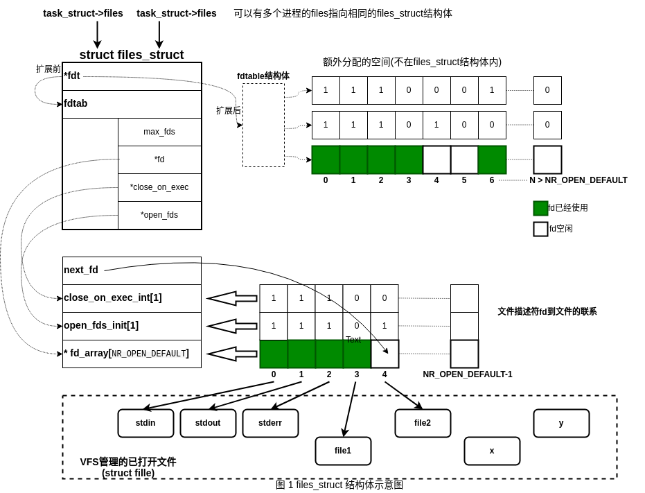
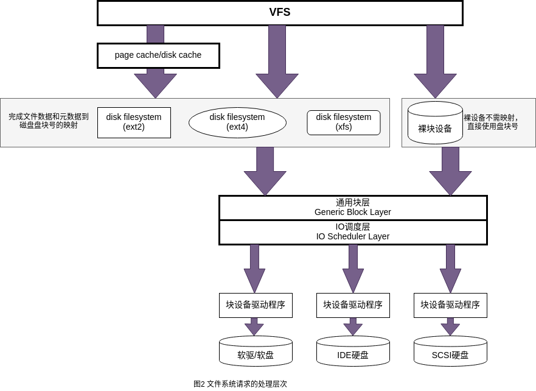

可以从用户进程、`Linux`内核、磁盘三个视角来观察。

- 用户进程看待文件:

  1. 按照目录形式命名；
  2. 可能随机访问的有序字节集合(无结构)；
  3. 具有特定文件属主和文件访问权限；
- `Linux`内核看待文件:

  1. 该层是磁盘上各种数据在内核中的动态影像，含文件对象、目录、索引节点、文件数据的页缓存，以及文件系统本身的信息等；
  2. 上述所描述的动态影像分为VFS层、具体的文件系统层和通用IO层；
  3. 文件在内核中的页缓存也由内核管理；
- 磁盘文件上的概念:

  1. 包含文件数据的存储格式及其访问规则；

## 进程中的文件信息

进程的`task_struct`中与文件系统相关的主要有两个结构体，其中：

- `fs_struct`主要用于描述进程的根目录(可以和系统根目录不同)和当前目录

- `files_struct`描述当前进程所打开的文件


```c
struct task_struct {
    ...
    /* Filesystem information: */
    struct fs_struct        *fs;

    /* Open file information: */
    struct files_struct        *files;
  ...
};
```

### 进程的文件系统基本信息

`fs_struct`的定义如下：

```c
struct fs_struct {
    /*被共享的次数，进程在创建子进程/线程时，可以通过传递的标志控制父子进程是否共享原有 fs_struct*/
    int users;
    spinlock_t lock;
    seqcount_spinlock_t seq;
    /*进程创建文件时的默认访问权限*/
    int umask;
    int in_exec;
    /*
    * root: 进程使用的根目录(可通过chroot改变默认的根目录，默认使用系统根目录)，root->dentry；
    * pwd: 进程使用的当前目录，pwd->dentry；
    */
    struct path root, pwd;
} __randomize_layout;
```

`struct path`结构体定义如下：

```c
struct path {
    /*
     * mnt: path所指向的目录的挂载点信息
    */
    struct vfsmount *mnt;
    /*
     * dentry: path指向的目录的目录项对象
     */
    struct dentry *dentry;
} __randomize_layout;
```

### 已打开文件信息

进程所打开的文件记录在进程描述符的`files`字段，其定义如下：

```c
/*
* Open file table structure
*/
struct files_struct {
    /*
     * read mostly part
     */
    /* count: 被(共享)引用的次数，多个进程可以共享同一个files_struct实例(比如多线程) */
    atomic_t count;
    bool resize_in_progress;
    wait_queue_head_t resize_wait;

    /* fdt: 初始时指向本结构的fdtab成员 */
    struct fdtable __rcu *fdt;
    /* fdtab: 指向文件描述符表和相关位图 */
    struct fdtable fdtab;
    /*
     * written part on a separate cache line in SMP
     */
    spinlock_t file_lock ____cacheline_aligned_in_smp;
    /* next_fd: 下一次打开新文件时使用的文件描述符*/
    unsigned int next_fd;
    /* close_on_exec_init:执行exec时将关闭的文件描述符 */
    unsigned long close_on_exec_init[1];
    /* open_fds_init:当前进程已打开文件的位图 */
    unsigned long open_fds_init[1];
    unsigned long full_fds_bits_init[1];
    /*
    * fd_array:记录当前进程打开的所有文件
    * 用户进程空间使用文件描述符充当该数组的索引
    */
    struct file __rcu * fd_array[NR_OPEN_DEFAULT];
};
```

`task_struct->files`字段的作用如下：

1. 本进程已打开文件的文件描述符；
2. 进程打开的文件描述符和`VFS`中记录的已打开文件对象之间的联系；

在`struct files_struct`中有两个重要的成员`*fdt`和`fdtab`，其定义如下：

```c
struct fdtable {
    /* max_fds: 当前进程所能打开的文件数目最大值，可调整 */
    unsigned int max_fds;
    /* fd: 初始时指向当前进程 files_struct->fd_array[]，进程用户空间使用文件描述符充当fd_array的索引 */
    struct file __rcu **fd;      /* current fd array */
    /* close_on_exec: 初始时指向 files_struct->close_on_exec_init[]，指定了exec时需要关闭的文件描述符 */
    unsigned long *close_on_exec;
    /* open_fds: 初始时指向 files_struct->open_fds_init[], 当前进程打开的所 文件描述符 */
    unsigned long *open_fds;
    unsigned long *full_fds_bits;
    struct rcu_head rcu;
};
```

因此，整个`files_struct`的关系如下图所示：
<div align=center></div>
默认情况下，一个进程能打开的最大文件数量为`NR_OPEN_DEFAULT`(在64位系统上，默认为64)。当进程打开的文件数量超过默认值时，通过`expand_files`函数重新分配一个空间来容纳更多的文件，此时新分配的`fdtable`结构体实例上的三个指针`fd`、`close_on_exec`、`open_fds`将指向新的位置，同时`fdt`指针也指向新分配的`fdtable`实例。参考图1中的扩展前和扩展后。扩展流程如下所述：

```c
/*
 * Expand files.
 * This function will expand the file structures, if the requested size exceeds
 * the current capacity and there is room for expansion.
 * Return <0 error code on error; 0 when nothing done; 1 when files were
 * expanded and execution may have blocked.
 * The files->file_lock should be held on entry, and will be held on exit.
 */
expand_files(struct files_struct *files, unsigned int nr)
    |——>files_fdtable(files)        //获取当前进程的fdt实例
    |——>expand_fdtable(files, nr)   //扩展fdtable
        |——>alloc_fdtable(nr)       //分配新的fdtable结构体实例
        |——>copy_fdtable(new_fdt, cur_fdt)  //将原fdtable中的数据拷贝到新的fdtable结构体实例中
        |——>rcu_assign_pointer(files->fdt, new_fdt); //将旧的fdtable实例替换为新的fdtable实例
```

**进程用户空间使用文件描述符(fd)来标识所打开的文件，而内核空间则使用`struct file`来联系所打开的文件。**

## VFS虚拟文件系统

`Linux`的`VFS`层屏蔽底层文件系统细节，对整个文件系统做了抽象。在`VFS`的通用文件模型中需要包含以下对象：

- **文件对象(File Object)**：存放已打开的文件信息，进程使用文件描述符联系文件对象(见图1)。文件对象仅仅是磁盘静态文件在内存中的动态"户口"，但是并不直接代表文件数据。

- **目录项对象(Dentry Object)**：存放文件特定识别名与对应文件进行关联的信息，目录项互相间构成了文件系统的树状组织关系。`VFS`目录项是磁盘上目录信息的一个子集(已访问过的)在内存中的影像。但是需要说明的是目录项对象没有对应的磁盘数据结构。

- **索引节点对象(Inode Object)**：索引节点的编号可以唯一的标识本文件系统(分区)中的文件，但分属于不同文件系统/分区上的不同文件可以有相同的索引号。*索引节点*又称为文件控制块，存放对应文件的基本信息——inode号、长度、访问方法和权限等。`VFS`索引节点是磁盘上的索引节点的内存影像和动态扩展。

- **超级块对象(Superblock Object)**：存放对应的已安装或者挂载文件系统的基本信息(一个超级块对应多个安装点，如果被同时安装到不同的安装点)，对于磁盘文件系统来说就是磁盘上的文件系统控制块的静态信息加上少量的动态管理信息。`VFS`超级块对象是磁盘上的超级块在内存中的影像和动态扩展。
  **总结：
  1.索引节点对象inode唯一的代表文件；目录项对象dentry将文件组织成目录树状结构；文件对象file是进程访问文件的接口及现场；超级块对象super_block则记录了整个文件系统的全局性的信息。
  2.文件内容和它的管理数据分别称为数据与元数据(元数据在inode中)。inode上的元数据操作涉及整个文件对象-例如创建、删除、链接等；而file文件对象的数据操作则是对文件内容的-读、写、移动文件指针、建立内存映射。
  3.文件系统使用磁盘时往往不是用扇区作为最小存储单位，而是使用盘块-若干个连续的扇区为最小单位。但是底层的驱动程序则使用扇区作为访问单位。**

## 文件系统分层

一般而言文件系统的分层模型如图2所示。

  <div align=center></div>


对文件的操作经过系统调用进入到通用的VFS层统一处理；VFS层根据所使用的缓冲方式，可能经过页缓存快速完成或者跳过页缓存，将请求发送到具体文件系统或块设备上；文件系统或块设备根据这些请求，计算出相应的磁盘盘块号，将请求转给通用块层；通用块层再利用IO调度层将请求合并、调度等优化后向驱动程序发出请求；驱动程序发出的硬件命令由硬盘驱动器执行，然后通过中断逐层向上通知，从而完成一个IO。

