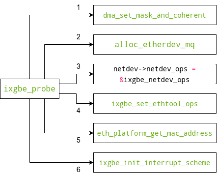

通常来说如下代码在网络通信中用于接收对端的数据:

```c
int main() {
    int sock = socket(AF_INET, SOCK_STREAM, 0);
    connect(sock, ...);
    read(sock, buffer, sizeof(buffer) - 1);
    ...
}
```

上述流程从用户态的角度来说比较简单，但是其背后涉及到了内核、网卡驱动等一列复杂的处理流程。本文以`linux-5.10.194`以及`ixgbe`网卡来阐述此流程。

## Linux网络收包概述

以`Linux`的视角看`TCP/IP`的网络分层模型如下图所示：

<div align=center></div>

`Linux`内核主要实现传输层和网络层，网卡驱动实现链路层。当网卡设备上有数据到达时，会给`CPU`的相关引脚触发一个电压变化，以通知`CPU`来处理数据；此种方式被称为中断。中断分为上半部和下半部：

- 上半部：只进行最简单的动作，快速处理然后释放`CPU`。

- 下半部：中断中剩下的大部分工作都由下半部继续处理。

`Linux`对于中断下半部的实现方式是软中断，由`ksoftirqd`内核线程全权处理。硬中断是通过给`CPU`物理引脚施加电压变化实现的，而软中断是通过给内存中的一个变量赋予二进制值以标记有软中断发生。

如下图总结了内核收包的路径图：


流程如下：

1. 数据帧从外部网络到达网卡。

2. 网卡收到数据，以`DMA`的方式把网卡收到的数据帧写到内存里。

3. 网卡向`CPU`发起一个中断，以通知`CPU`有数据到达。

4. `CPU`收到中断请求，调用网卡驱动注册的中断处理函数简单处理然后发出软中断，并快速释放`CPU`。

5. `ksoftirqd`内核线程检测到有软中断请求到达，调用`poll`开始轮询收包，最后交由各级协议栈处理。

## Linux启动

在真正能处理外部数据帧之前，内核协议栈、网卡驱动需要做很多的准备工作。

### 创建ksoftirqd内核线程

`Linux`内核中的软中断都是在内核线程`ksoftirqd`中进行的。系统上`ksoftirqd`线程的数等于`CPU`的数量(可以使用`ps -ef | grep ksoftirqd`查看)。

在`Linux`系统初始化的时候调用`early_initcall(spawn_ksoftirqd)`来创建`ksoftirqd`内核线程。关于`early_initcall`的机制请参考[Linux的initcall机制](https://zhuanlan.zhihu.com/p/627521955)，此处不做详细说明。`spawn_ksoftirqd`函数流程如下:

```c
static __init int spawn_ksoftirqd(void)
{
    cpuhp_setup_state_nocalls(CPUHP_SOFTIRQ_DEAD, "softirq:dead", NULL,
                  takeover_tasklets);
    BUG_ON(smpboot_register_percpu_thread(&softirq_threads));

    return 0;
}
early_initcall(spawn_ksoftirqd);
```

可以看到`spawn_ksoftirqd`将`softirq_threads`结构体以地址的形式传入`smpboot_register_percpu_thread`。如下所示为相关的代码：

```c
static struct smp_hotplug_thread softirq_threads = {
    .store            = &ksoftirqd,
    .thread_should_run    = ksoftirqd_should_run,    // 调度到该线程时，判断能否执行
    .thread_fn        = run_ksoftirqd,               // 调度到该线程时，执行的回调函数
    .thread_comm        = "ksoftirqd/%u",
};
```

```c
/**
 * smpboot_register_percpu_thread - Register a per_cpu thread related
 *                         to hotplug
 * @plug_thread:    Hotplug thread descriptor
 *
 * Creates and starts the threads on all online cpus.
 */
int smpboot_register_percpu_thread(struct smp_hotplug_thread *plug_thread)
{
    unsigned int cpu;
    int ret = 0;

    get_online_cpus();
    mutex_lock(&smpboot_threads_lock);
    for_each_online_cpu(cpu) {
        ret = __smpboot_create_thread(plug_thread, cpu);
        if (ret) {
            smpboot_destroy_threads(plug_thread);
            goto out;
        }
        smpboot_unpark_thread(plug_thread, cpu);
    }
    list_add(&plug_thread->list, &hotplug_threads);
out:
    mutex_unlock(&smpboot_threads_lock);
    put_online_cpus();
    return ret;
}
EXPORT_SYMBOL_GPL(smpboot_register_percpu_thread);
```

`smpboot_register_percpu_thread`会为每个`online CPU`创建对应的`ksoftirqd`内核线程，进入线程循环函数`ksoftirqd_should_run`和`run_ksoftirqd`。需要注意的是软中断不仅有网络软中断，还包括其他类型，参考如下：

```c
enum
{
    HI_SOFTIRQ=0,
    TIMER_SOFTIRQ,
    NET_TX_SOFTIRQ,
    NET_RX_SOFTIRQ,
    BLOCK_SOFTIRQ,
    IRQ_POLL_SOFTIRQ,
    TASKLET_SOFTIRQ,
    SCHED_SOFTIRQ,
    HRTIMER_SOFTIRQ,
    RCU_SOFTIRQ,    /* Preferable RCU should always be the last softirq */

    NR_SOFTIRQS
};
```

### 网络子系统初始化

在网络子系统的初始化过程中，会为每个`CPU`初始化`softnet_data`，也会为`NET_RX_SOFTIRQ`和`NET_TX_SOFTIRQ`注册处理函数，流程如下图所示：


从上图可知网络子系统的初始化由`net_dev_init`函数完成，该函数主要完成:

- 为每一个`CPU`申请一个`softnet_data`数据结构，这个数据结构里的`poll_list`用于等待驱动程序将其`poll`函数注册进来。

- 通过`open_softirq`为`NET_RX_SOFTIRQ`以及`NET_TX_SOFTIRQ`分别注册处理函数`net_rx_action`和`net_tx_action`。

如下所示为相关代码：

```c
static int __init net_dev_init(void)
{
    ...
    for_each_possible_cpu(i) {
        struct work_struct *flush = per_cpu_ptr(&flush_works, i);
        // 为当前cpu创建softnet_data数据
        struct softnet_data *sd = &per_cpu(softnet_data, i);
        ...
        // 注册poll_list
        INIT_LIST_HEAD(&sd->poll_list);
        sd->output_queue_tailp = &sd->output_queue;
#ifdef CONFIG_RPS
        sd->csd.func = rps_trigger_softirq;
        sd->csd.info = sd;
        sd->cpu = i;
#endif
        ...
    }
    ...
    // 注册net_tx_action
    open_softirq(NET_TX_SOFTIRQ, net_tx_action);
    // 注册net_rx_action
    open_softirq(NET_RX_SOFTIRQ, net_rx_action);
    ...
    return rc;
}
subsys_initcall(net_dev_init);
```

通过`open_softirq`可以发现，软中断处理函数最终记录在`softirq_vec`变量里，后面`ksoftirqd`线程收到软中断的时候，也会使用`softirq_vec`变量来找到每一种软中断所对应的处理函数：

```c
void open_softirq(int nr, void (*action)(struct softirq_action *))
{
    softirq_vec[nr].action = action;
}
```

`softirq_vec`变量定义如下:

```c
static struct softirq_action softirq_vec[NR_SOFTIRQS] __cacheline_aligned_in_smp;
```

可以看到`softirq_vec`其实就是结构体`struct softirq_action`组成的数组。一个`struct softirq_action`表示某一类型的软中断处理函数：

```c
struct softirq_action
{
    void    (*action)(struct softirq_action *);
};
```

### 协议栈注册

内核实现了网络层的`IP`协议，也实现了传输层的`TCP`协议和`UDP`协议。内核通过`fs_initcall`调用`inet_init`来完成协议栈的一系列初始化：

- 注册协议栈各层的处理函数。

- 添加主要的协议。

- 初始化各层协议。

具体可参加如下图：


`tcp_prot`定义指定了`TCP`协议栈的接口函数，用户态的系统调用最终会调用到对应的如下函数：

```c
struct proto tcp_prot = {
    .name            = "TCP",
    .owner            = THIS_MODULE,
    .close            = tcp_close,
    .pre_connect        = tcp_v4_pre_connect,
    .connect        = tcp_v4_connect,
    .disconnect        = tcp_disconnect,
    .accept            = inet_csk_accept,
    .ioctl            = tcp_ioctl,
    .init            = tcp_v4_init_sock,
    .destroy        = tcp_v4_destroy_sock,
    .shutdown        = tcp_shutdown,
    .setsockopt        = tcp_setsockopt,
    .getsockopt        = tcp_getsockopt,
    .bpf_bypass_getsockopt    = tcp_bpf_bypass_getsockopt,
    .keepalive        = tcp_set_keepalive,
    .recvmsg        = tcp_recvmsg,
    .sendmsg        = tcp_sendmsg,
    .sendpage        = tcp_sendpage,
    .backlog_rcv        = tcp_v4_do_rcv,
    .release_cb        = tcp_release_cb,
    ...
};
EXPORT_SYMBOL(tcp_prot);
```

`inet_add_protocol(&tcp_protocol, IPPROTO_TCP)`将`tcp_v4_rcv`注册到`inet_protos`数组中。当有`TCP`数据报文到达时，`IP`层会调用此`tcp_v4_rcv`用于接收数据报文。总的来看`inet_add_protocol`函数将`TCP`和`UDP`对应的数据报文接收函数注册到`inet_protos`数组中。

```c
int inet_add_protocol(const struct net_protocol *prot, unsigned char protocol)
{
    if (!prot->netns_ok) {
        pr_err("Protocol %u is not namespace aware, cannot register.\n",
            protocol);
        return -EINVAL;
    }

    return !cmpxchg((const struct net_protocol **)&inet_protos[protocol],
            NULL, prot) ? 0 : -1;
}
```

对于`IP`报文，函数`dev_add_pack(&ip_packet_type)`将`ip_rcv`注册到`ptype_base`哈希表中。当有`IP`报文到达时，调用`ip_rcv`进行处理。`ip_packet_type`定义如下，此处`type`定义为`#define ETH_P_IP 0x0800`：

```c
static struct packet_type ip_packet_type __read_mostly = {
    .type = cpu_to_be16(ETH_P_IP),
    .func = ip_rcv,
    .list_func = ip_list_rcv,
};
```

`dev_add_pack`函数实现如下：

```c
void dev_add_pack(struct packet_type *pt)
{
    struct list_head *head = ptype_head(pt);

    spin_lock(&ptype_lock);
    list_add_rcu(&pt->list, head);
    spin_unlock(&ptype_lock);
}
EXPORT_SYMBOL(dev_add_pack);
```

```c
static inline struct list_head *ptype_head(const struct packet_type *pt)
{
    if (pt->type == htons(ETH_P_ALL))
        return pt->dev ? &pt->dev->ptype_all : &ptype_all;
    else
        return pt->dev ? &pt->dev->ptype_specific :
                 &ptype_base[ntohs(pt->type) & PTYPE_HASH_MASK];
}
```

软中断通过`ptype_base`找到`ip_rcv`的函数地址，进而将`IP`报文正确的送到`ip_rcv`中执行。在`ip_rcv`中通过`inet_protos`找到`TCP`或者`UDP`的处理函数地址，然后把报文转发给`tcp_v4_rcv`或者`udp_rcv`函数。对于接受数据报文，还需要网卡驱动完成初始化并且网卡处于启动状态。

## 网卡驱动初始化

驱动设备编译时，`MODULE_DEVICE_TABLE`宏会导出一个 global 的 `PCI` 设备 `ID` 列表， 驱动据此识别它可以控制哪些设备，这样内核就能对各设备加载正确的驱动:

```c
#ifdef MODULE
/* Creates an alias so file2alias.c can find device table. */
#define MODULE_DEVICE_TABLE(type, name)                    \
extern typeof(name) __mod_##type##__##name##_device_table        \
  __attribute__ ((unused, alias(__stringify(name))))
#else  /* !MODULE */
#define MODULE_DEVICE_TABLE(type, name)
#endif
```

`ixgbe`驱动的设备表和`PCI`设备`ID`:

```c
/* ixgbe_pci_tbl - PCI Device ID Table
 *
 * Wildcard entries (PCI_ANY_ID) should come last
 * Last entry must be all 0s
 *
 * { Vendor ID, Device ID, SubVendor ID, SubDevice ID,
 *   Class, Class Mask, private data (not used) }
 */
static const struct pci_device_id ixgbe_pci_tbl[] = {
    {PCI_VDEVICE(INTEL, IXGBE_DEV_ID_82598), board_82598 },
    {PCI_VDEVICE(INTEL, IXGBE_DEV_ID_82598AF_DUAL_PORT), board_82598 },
    {PCI_VDEVICE(INTEL, IXGBE_DEV_ID_82598AF_SINGLE_PORT), board_82598 },
    {PCI_VDEVICE(INTEL, IXGBE_DEV_ID_82598AT), board_82598 },
    {PCI_VDEVICE(INTEL, IXGBE_DEV_ID_82598AT2), board_82598 },
    {PCI_VDEVICE(INTEL, IXGBE_DEV_ID_82598EB_CX4), board_82598 },
    ...
    {PCI_VDEVICE(INTEL, IXGBE_DEV_ID_82598_SR_DUAL_PORT_EM), board_82598 },
    {PCI_VDEVICE(INTEL, IXGBE_DEV_ID_82598EB_XF_LR), board_82598 },
    {PCI_VDEVICE(INTEL, IXGBE_DEV_ID_82598EB_SFP_LOM), board_82598 },
    {PCI_VDEVICE(INTEL, IXGBE_DEV_ID_82598_BX), board_82598 },
    {PCI_VDEVICE(INTEL, IXGBE_DEV_ID_82599_KX4), board_82599 },
    ...
    /* required last entry */
    {0, }
};
MODULE_DEVICE_TABLE(pci, ixgbe_pci_tbl);
```

驱动程序使用`module_init`向内核注册一个初始化函数，当驱动程序被加载时，内核会调用这个函数。如下为`ixgbe`网卡定义的相关操作函数:

```c
static struct pci_driver ixgbe_driver = {
    .name      = ixgbe_driver_name,
    .id_table  = ixgbe_pci_tbl,
    .probe     = ixgbe_probe,  //  系统探测到ixgbe网卡后调用ixgbe_probe
    .remove    = ixgbe_remove,
    .driver.pm = &ixgbe_pm_ops,
    .shutdown  = ixgbe_shutdown,
    .sriov_configure = ixgbe_pci_sriov_configure,
    .err_handler = &ixgbe_err_handler
};
```

当内核加载`ixgbe`网卡驱动时`(比如使用insmod ixgbe或者modprobe ixgbe)`，会调用`ixgbe_init_module`:

```c
/**
 * ixgbe_init_module - Driver Registration Routine
 *
 * ixgbe_init_module is the first routine called when the driver is
 * loaded. All it does is register with the PCI subsystem.
 **/
static int __init ixgbe_init_module(void)
{
    int ret;
    ...
    ixgbe_wq = create_singlethread_workqueue(ixgbe_driver_name);
    ...
    // 注册ixgbe_driver
    ret = pci_register_driver(&ixgbe_driver);
    ...
#ifdef CONFIG_IXGBE_DCA
    dca_register_notify(&dca_notifier);
#endif

    return 0;
}

module_init(ixgbe_init_module);
```

`ixgbe_init_module`调用`pci_register_driver(&ixgbe_driver)`后，内核就知道`ixgbe`网卡驱动的`ixgbe_driver_name`和`ixgbe_probe`等函数地址以及其他一些驱动信息。网卡驱动被识别后，内核会调用其`probe`方法(`ixgbe_probe`)让网卡设备处于就绪状态。对于`ixgbe`网卡，其`ixgbe_probe`位于`drivers/net/ethernet/intel/ixgbe/ixgbe_main.c`:

```c
/**
 * ixgbe_probe - Device Initialization Routine
 * @pdev: PCI device information struct
 * @ent: entry in ixgbe_pci_tbl
 *
 * Returns 0 on success, negative on failure
 *
 * ixgbe_probe initializes an adapter identified by a pci_dev structure.
 * The OS initialization, configuring of the adapter private structure,
 * and a hardware reset occur.
 **/
static int ixgbe_probe(struct pci_dev *pdev, const struct pci_device_id *ent)
{    
    ...
    // ent此处为ixgbe_pci_tbl变量，本质上就是根据ixgbe网卡型号选择ixgbe_info
    const struct ixgbe_info *ii = ixgbe_info_tbl[ent->driver_data];
    ...
    /*
     * pci_enable_device_mem()最终调用pci_write_config_word()
     * 向配置寄存器Command（0x04）中写入PCI_COMMAND_MEMORY（0x2），
     * 允许网卡驱动访问网卡的Memory空间
     */
    err = pci_enable_device_mem(pdev);
    ...
    // 向配置寄存器Command（0x04）中写入PCI_COMMAND_MASTER（0x4），
    // 允许网卡申请PCI总线控制权
    pci_set_master(pdev);
    // 保存配置空间
    pci_save_state(pdev);
    ...
    // 分配net_device和ixgbe_adapter
    netdev = alloc_etherdev_mq(sizeof(struct ixgbe_adapter), indices);
    ...
    adapter = netdev_priv(netdev); // 得到ixgbe_adapter的指针
    ...
    hw = &adapter->hw; // 得到ixgbe_hw的指针
    ...
    // 将BAR0中的总线地址映射成内存地址，赋给hw->hw_addr，
    // 允许网卡驱动通过hw->hw_addr访问网卡的BAR0对应的Memory空间
    hw->hw_addr = ioremap(pci_resource_start(pdev, 0),
			      pci_resource_len(pdev, 0));
	adapter->io_addr = hw->hw_addr;
    ...
    // 注册ixgbe_netdev_ops
    netdev->netdev_ops = &ixgbe_netdev_ops;
}
```

加载`ixgbe`网卡驱动时函数`ixgbe_probe`主要操作如下所示：



一般来说，网卡驱动`probe`的标准操作有:

1. 使能`PCI`设备。
2. 请求内存区域以及`IO`端口。
3. 设置`DMA`掩码。
4. 分配`struct net_device`数据结构。
5. 注册`struct net_device_ops`数据结构；该数据结构包含各种函数指针，用于操作对应的网卡设备。
6. 注册对应网卡设备的`ethtool`函数。

**dma_set_mask_and_coherent**

`dma_set_mask_and_coherent`函数设置`ixgbe`网卡的`DMA`掩码和一致性属性。

**alloc_etherdev_mq**

- 分配`struct net_device`结构体指针。

- 设置相关的回调函数。

- 初始化分配的`struct net_device`结构体指针某些字段。

**netdev->netdev_ops = &ixgbe_netdev_ops**

注册`ixgbe`网卡设备的操作函数：

```c
static const struct net_device_ops ixgbe_netdev_ops = {
    .ndo_open        = ixgbe_open,
    .ndo_stop        = ixgbe_close,
    .ndo_start_xmit        = ixgbe_xmit_frame,
    .ndo_set_rx_mode    = ixgbe_set_rx_mode,
    .ndo_validate_addr    = eth_validate_addr,
    .ndo_set_mac_address    = ixgbe_set_mac,
    .ndo_change_mtu        = ixgbe_change_mtu,
    .ndo_tx_timeout        = ixgbe_tx_timeout,
    .ndo_set_tx_maxrate    = ixgbe_tx_maxrate,
    ...
};
```

**ixgbe_set_ethtool_ops**

设置`ixgbe`网卡的`ethtool`回调函数：

```c
void ixgbe_set_ethtool_ops(struct net_device *netdev)
{
    netdev->ethtool_ops = &ixgbe_ethtool_ops;
}
```

`ixgbe_ethtool_ops`结构体定义如下：

```c
static const struct ethtool_ops ixgbe_ethtool_ops = {
    .supported_coalesce_params = ETHTOOL_COALESCE_USECS,
    .get_drvinfo            = ixgbe_get_drvinfo,
    .get_regs_len           = ixgbe_get_regs_len,
    .get_regs               = ixgbe_get_regs,
    .get_wol                = ixgbe_get_wol,
    .set_wol                = ixgbe_set_wol,
    .nway_reset             = ixgbe_nway_reset,
    ...
};
```

如果使用`ethtool`命令对`ixgbe`网卡进行操作，最终会调用到`ixgbe_set_ethtool_ops`函数注册的回调函数上。因此，当使用`ethtool`命令查看网卡收发包统计、调整网卡`RX`队列的数量和大小是因为`ethtool`命令最终调用可网卡驱动的相应方法。

**eth_platform_get_mac_address**

`eth_platform_get_mac_address`函数获取网卡设备的`MAC`地址，并填充到`netdev->dev_addr`中。

**ixgbe_init_interrupt_scheme**

此函数负责初始化`ixgbe`网卡的中断方案。对于网卡设备来说正确初始化中断是及其重要的。`ixgbe_init_interrupt_scheme`先检查硬件是否支持`MSI-X`，然后调用`netif_napi_add`给每个中断设置`ixgbe_poll`回调。如下所示为`ixgbe_init_interrupt_scheme`函数的调用关系图：


**netif_napi_add**函数：

```c
/* initialize NAPI */
netif_napi_add(adapter->netdev, &q_vector->napi,
               ixgbe_poll, 64);
```

`netif_napi_add`函数注册一个`NAPI`机制必须的函数。对于`ixgbe`网卡来说，这个函数是**ixgbe_poll**，用于轮询网卡接收队列，处理接收到的数据包。

## 启动网卡

上面的初始化流程都完成以后，就可以启动网卡了。在[`网卡驱动初始化`](#网卡驱动初始化)中注册了`ixgbe`网卡设备的操作函数，包含了网卡启用、发包、设置`MAC`地址等回调函数。

```c
static const struct net_device_ops ixgbe_netdev_ops = {
    .ndo_open        = ixgbe_open,
    .ndo_stop        = ixgbe_close,
    .ndo_start_xmit        = ixgbe_xmit_frame,
    .ndo_set_rx_mode    = ixgbe_set_rx_mode,
    .ndo_validate_addr    = eth_validate_addr,
    ...
}
```

当执行`ifconfig enp97s0f0 up`时，`net_device_ops`变量中的`ndo_open`函数会被调用。对于`ixgbe`网卡而言，最终调用的是`ixgbe_open`方法：

```c
/**
 * ixgbe_open - Called when a network interface is made active
 * @netdev: network interface device structure
 *
 * Returns 0 on success, negative value on failure
 *
 * The open entry point is called when a network interface is made
 * active by the system (IFF_UP).  At this point all resources needed
 * for transmit and receive operations are allocated, the interrupt
 * handler is registered with the OS, the watchdog timer is started,
 * and the stack is notified that the interface is ready.
 **/
int ixgbe_open(struct net_device *netdev)
{
    ...
    netif_carrier_off(netdev);

    /* allocate transmit descriptors */
    // 同接收
    err = ixgbe_setup_all_tx_resources(adapter);
    ...
    /* allocate receive descriptors
     * 分配发送队列，每个队列申请自己的 DMA 地址，
     * 总长度 sizeof(struct ixgbe_tx_buffer) * tx_ring->count,
     * 其中 count 就是大家常说的网卡队列 ring buffer 个数，默认 512，一般都要调大，防止丢包。
     */
    err = ixgbe_setup_all_rx_resources(adapter);
    if (err)
        goto err_setup_rx;
    /* 设置网卡虚拟化，接收模式等，
     * 调用 ixgbe_configure_tx, ixgbe_configure_rx配置硬件接收发送队列。
     */
    ixgbe_configure(adapter);
    /* 初始化中断
     * 对于支持MSI-X的系统来说，最终调用ixgbe_request_msix_irqs
     */
    err = ixgbe_request_irq(adapter);
    if (err)
        goto err_req_irq;

    /* Notify the stack of the actual queue counts. */
    queues = adapter->num_tx_queues;
    err = netif_set_real_num_tx_queues(netdev, queues);
    ...
    queues = adapter->num_rx_queues;
    err = netif_set_real_num_rx_queues(netdev, queues);
    ...
    // ixgbe_up_complete->ixgbe_napi_enable_all->napi_enable启用NAPI
    ixgbe_up_complete(adapter);
    ...
}
```

**ixgbe_setup_all_rx_resources**

在`ixgbe_open`中调用`ixgbe_setup_all_rx_resources`分配`RingBuffer`，并建立与内存的映射关系:

```c
/**
 * ixgbe_setup_all_rx_resources - allocate all queues Rx resources
 * @adapter: board private structure
 *
 * If this function returns with an error, then it's possible one or
 * more of the rings is populated (while the rest are not).  It is the
 * callers duty to clean those orphaned rings.
 *
 * Return 0 on success, negative on failure
 **/
static int ixgbe_setup_all_rx_resources(struct ixgbe_adapter *adapter)
{
    int i, err = 0;

    for (i = 0; i < adapter->num_rx_queues; i++) {
        err = ixgbe_setup_rx_resources(adapter, adapter->rx_ring[i]);
        ...
    }
    ...
}
```

上面的循环中，创建了若干个接收队列。下图所示为接收队列，发送队列类似。


接下来看看每一个队列是如何创建出来的：

```c
/**
 * ixgbe_setup_rx_resources - allocate Rx resources (Descriptors)
 * @adapter: pointer to ixgbe_adapter
 * @rx_ring:    rx descriptor ring (for a specific queue) to setup
 *
 * Returns 0 on success, negative on failure
 **/
int ixgbe_setup_rx_resources(struct ixgbe_adapter *adapter,
                 struct ixgbe_ring *rx_ring)
{
    ...
    // ixgbe_rx_buffer的size
    size = sizeof(struct ixgbe_rx_buffer) * rx_ring->count;

    if (rx_ring->q_vector)
        ring_node = rx_ring->q_vector->numa_node;
    // 分配ixgbe_rx_buffer队列内存
    rx_ring->rx_buffer_info = vmalloc_node(size, ring_node);
    ...
    /* Round up to nearest 4K */
    // 分配ixgbe_adv_rx_desc队列内存
    rx_ring->size = rx_ring->count * sizeof(union ixgbe_adv_rx_desc);
    rx_ring->size = ALIGN(rx_ring->size, 4096);
    set_dev_node(dev, ring_node);
    rx_ring->desc = dma_alloc_coherent(dev,
                       rx_ring->size,
                       &rx_ring->dma,
                       GFP_KERNEL);
    ...
    // 初始化队列成员
    rx_ring->next_to_clean = 0;
    rx_ring->next_to_use = 0;
    ...
}
```

通过上述代码可以看到，实际上一个`rx_ring`内部有两个环形队列，如下图所示：

- **ixgbe_rx_buffer**数组：这个数组是内核使用，通过`vmalloc_node`申请的。

- **ixgbe_adv_rx_desc**：这个数组是网卡硬件使用的，通过`dma_alloc_coherent`分配。


**ixgbe_request_irq**

接下来使用`ixgbe_request_irq`注册中断:

```c
/**
 * ixgbe_request_irq - initialize interrupts
 * @adapter: board private structure
 *
 * Attempts to configure interrupts using the best available
 * capabilities of the hardware and kernel.
 **/
static int ixgbe_request_irq(struct ixgbe_adapter *adapter)
{
    ...
    if (adapter->flags & IXGBE_FLAG_MSIX_ENABLED)
        // 若网卡设备支持MSI-X中断则初始化MSI-X中断
        err = ixgbe_request_msix_irqs(adapter);
    else if (adapter->flags & IXGBE_FLAG_MSI_ENABLED)
        // 若网卡设备支持MSI中断则初始化MSI中断并注册ixgbe_intr中断函数
        err = request_irq(adapter->pdev->irq, ixgbe_intr, 0,
                  netdev->name, adapter);
    else
        // 若网卡设备只支持传统的中断，注册ixgbe_intr中断函数
        err = request_irq(adapter->pdev->irq, ixgbe_intr, IRQF_SHARED,
                  netdev->name, adapter);
    ...
}
```

可以使用`lspci`命令查看对应网卡是否支持`MSI-X`中断:

```bash
# root @ caesar-PC in ~ [22:34:19]
$ lspci -vvv | grep "Intel Corporation 82599ES 10-Gigabit" -A 50
61:00.0 Ethernet controller: Intel Corporation 82599ES 10-Gigabit SFI/SFP+ Network
...
    Interrupt: pin A routed to IRQ 97
...
    Capabilities: [70] MSI-X: Enable+ Count=64 Masked-
            Vector table: BAR=4 offset=00000000
            PBA: BAR=4 offset=00002000
...
    Capabilities: [160 v1] Single Root I/O Virtualization (SR-IOV)
        ...
        Initial VFs: 64, Total VFs: 64, Number of VFs: 0, Function Dependency Link: 00
        ...
    Kernel driver in use: ixgbe
    Kernel modules: ixgbe
...
```

从上述输出中可以观察到一些关键信息:

1. 硬件中断：`IRQ 97`，支持`MSI-X(Capabilities: [70] MSI-X: Enable+)`。

2. 当前使用的网卡驱动为`ixgbe`，对应的内核模块是`ixgbe`。

3. 支持`sriov`。

`ixgbe_request_msix_irqs`简要版实现如下：

```c
/**
 * ixgbe_request_msix_irqs - Initialize MSI-X interrupts
 * @adapter: board private structure
 *
 * ixgbe_request_msix_irqs allocates MSI-X vectors and requests
 * interrupts from the kernel.
 **/
static int ixgbe_request_msix_irqs(struct ixgbe_adapter *adapter)
{
    ...
    for (vector = 0; vector < adapter->num_q_vectors; vector++) {
        struct ixgbe_q_vector *q_vector = adapter->q_vector[vector];
        struct msix_entry *entry = &adapter->msix_entries[vector];
        ...
        // 为每一个vector注册硬中断处理函数ixgbe_msix_clean_rings
        err = request_irq(entry->vector, &ixgbe_msix_clean_rings, 0,
                  q_vector->name, q_vector);
        ...
        /* If Flow Director is enabled, set interrupt affinity */
        if (adapter->flags & IXGBE_FLAG_FDIR_HASH_CAPABLE) {
            /* assign the mask for this irq */
            // 不同的中断向量可以由不同的CPU进行处理
            irq_set_affinity_hint(entry->vector,
                          &q_vector->affinity_mask);
        }
    }
    ...
    err = request_irq(adapter->msix_entries[vector].vector,
              ixgbe_msix_other, 0, netdev->name, adapter);
    ...
    return 0;
}
```

从上述代码中可以看到，在`MSI-X`的情况下为每个`RX`队列注册了硬中断回调函数`ixgbe_msix_clean_rings`，因此从网卡硬件中断的层面就可以设置让收到的包被不同的`CPU`处理。如下所示为`ixgbe_request_msix_irqs`的调用关系:


## 硬中断处理

数据报文从网线到达网卡上的时候，首先到达网卡的接收队列。网卡会在之前分配的`rx_ring_buffer`中寻找可用的内存，找到后直接将数据报文`DMA`到网卡之前关联的内存里。`DMA`操作完成后，网卡会向`CPU`发起一个硬中断，通知`CPU`有数据到达。根据上文所述，`CPU`收到`MSI-X`中断时会调用`ixgbe`网卡主驱动注册的中断处理函数`ixgbe_request_msix_irqs`，最终会调用到`____napi_schedule`:

```c
/* Called with irq disabled */
static inline void ____napi_schedule(struct softnet_data *sd,
                     struct napi_struct *napi)
{
    list_add_tail(&napi->poll_list, &sd->poll_list);
    __raise_softirq_irqoff(NET_RX_SOFTIRQ);
}
```

`____napi_schedule`主要干了两件事情:

- 将硬中断函数传过来的`struct napi_struct`加入到当前`CPU struct softnet_data`数据结构的`poll_list`成员上。

- `__raise_softirq_irqoff`触发一个`NET_RX_SOFTIRQ`软中断，这将触发执行网络子系统初始化时注册的`net_rx_action`，参考[网络子系统初始化](#网络子系统初始化)中`open_softirq(NET_RX_SOFTIRQ, net_rx_action)`。

驱动的硬中断处理函数做的事情很少，大部分工作由软中断完成。此外，软中断会和硬中断在相同的`CPU`上运行。

## 软中断处理

在[创建ksoftirqd内核线程](#创建ksoftirqd内核线程)提到`ksoftirqd`线程由`smpboot_register_percpu_thread`创建，其最终会调用`kthread_create_on_cpu`为每一个`CPU`注册一个`smpboot_thread_fn`函数:

```c
smpboot_thread_fn
  |-struct smpboot_thread_data *td = data;
  |-struct smp_hotplug_thread *ht = td->ht;
  |-while (1) {
      set_current_state(TASK_INTERRUPTIBLE); // 设置当前 CPU 为可中断状态
      ...
      if !ht->thread_should_run(td->cpu) {   // 无 pending 的软中断
          preempt_enable_no_resched();
          schedule();
      } else {                               // 有 pending 的软中断
          __set_current_state(TASK_RUNNING);
          preempt_enable();
          ht->thread_fn(td->cpu);        // 如果此时执行的是 ksoftirqd 线程，
            |-run_ksoftirqd              // 执行 run_ksoftirqd() 回调函数
                |-local_irq_disable();   // 关闭所在 CPU 的所有硬中断
                |
                |-if local_softirq_pending() {
                |    __do_softirq();
                |    local_irq_enable();      // 重新打开所在 CPU 的所有硬中断
                |    cond_resched();          // 将 CPU 交还给调度器
                |    return;
                |-}
                |
                |-local_irq_enable();         // 重新打开所在 CPU 的所有硬中断
      }
    }
```

### __do_softirq

如果此时调度到的是`ksoftirqd`线程，并且有`pending`的软中断等待处理，那么`thread_fn`执行的就是`run_ksoftirqd`:

```c
static void run_ksoftirqd(unsigned int cpu)
{
    local_irq_disable(); // 关闭所在CPU的所有硬中断
    if (local_softirq_pending()) {
        /*
         * We can safely run softirq on inline stack, as we are not deep
         * in the task stack here.
         */
        __do_softirq();// 处理pending的softirq
        local_irq_enable();//重新打开所在CPU的硬中断
        cond_resched();
        return;
    }
    local_irq_enable();
}
```

首先调用`local_irq_disable`关闭所在`CPU`的所有硬中断；然后判断是否有`pending softirq`，有就执行`__do_softirq`处理软中断，接下来重新打开打开所在`CPU`的硬中断并主动放弃`CPU`的使用权，以便其他任务能够运行。若没有待处理的`pending softirq`，则直接打开所在`CPU`的硬中断。`__do_softirq`会调用注册的`net_rx_action`:

```c
asmlinkage __visible void __softirq_entry __do_softirq(void)
{
    unsigned long end = jiffies + MAX_SOFTIRQ_TIME; // 轮询最长时间
    ...
    int max_restart = MAX_SOFTIRQ_RESTART;// 轮询的最大次数
    ...
    pending = local_softirq_pending(); // 获取pending的softirq数量
    ...
restart:
    ...
    while ((softirq_bit = ffs(pending))) {
        ...
        // 若是NET_RX_SOFTIRQ则指向net_rx_action
        h->action(h);
        ...
    }
    ...
    // 再次获取 pending softirq 的数量
    pending = local_softirq_pending();
    if (pending) {
        if (time_before(jiffies, end) && !need_resched() && --max_restart)
            goto restart;

        wakeup_softirqd();
    }
    ...
}
```

### net_rx_action

一旦软中断代码判断有`NET_RX_SOFTIRQ`处于`pending`状态，就会调用**net_rx_action**从`ring buffer`收包:

```c
static __latent_entropy void net_rx_action(struct softirq_action *h)
{
    // 获取当前CPU的 per cpu变量softnet_data
    struct softnet_data *sd = this_cpu_ptr(&softnet_data);
    // netdev_budget_usecs = 2 * USEC_PER_SEC / HZ;
    // USEC_PER_SEC: 1000000L
    // HZ: CONFIG_HZ
    // 一般情况下系统上CONFIG_HZ：1000
    // cat /proc/sys/net/core/netdev_budget_usecs
    unsigned long time_limit = jiffies +
        usecs_to_jiffies(READ_ONCE(netdev_budget_usecs));
    // int netdev_budget __read_mostly = 300;
    // cat /proc/sys/net/core/netdev_budget
    int budget = READ_ONCE(netdev_budget);
    LIST_HEAD(list);
    LIST_HEAD(repoll);
    ...
    list_splice_init(&sd->poll_list, &list);
    ...
    // 遍历sd->poll_list，执行ixgbe_poll函数
    for (;;) {
        if list_empty(&list) {
            ...
            break;
        }
        struct napi_struct *n;
        ...
        n = list_first_entry(&list, struct napi_struct, poll_list);
        // 调用napi_poll执行n->poll，对于ixgbe网卡来说其实最终调用的是ixgbe_poll
        // 并返回处理的数据帧数量，函数返回时，被处理的数据帧都已经发送到上层协议栈处理了
        budget -= napi_poll(n, &repoll);

        /* If softirq window is exhausted then punt.
         * Allow this to run for 2 jiffies since which will allow
         * an average latency of 1.5/HZ.
         */
        // 若budget或者time_limit使用完了，则退出数据帧处理流程
        if (unlikely(budget <= 0 ||
                 time_after_eq(jiffies, time_limit))) {
            sd->time_squeeze++;
            break;
        }
    }
    ...
    // 在给定的time_limit/budget内，没有能够处理完全部 napi
    // 关闭 NET_RX_SOFTIRQ 类型软中断，将 CPU 让给其他任务用，
    // 主动让出 CPU，不要让这种 softirq 独占 CPU 太久。
    if (!list_empty(&sd->poll_list))
        __raise_softirq_irqoff(NET_RX_SOFTIRQ);
    ..
}
```

以下三种情况会退出循环:

1. 当`list`为空时，说明没有`NAPI`需要处理。

2. `budget <= 0`时，说明处理的数据帧数量超过了`netdev_budget`。

3. `time_after_eq(jiffies, time_limit) == true`时，说明本次`softirq`累计运行时间已经大于等于`netdev_budget_us`。

从上述描述可知`netdev_budget`和`netdev_budget_usecs`参数控制了每次`softirq`能处理的数据帧数量，两个限制中的任何一个达到条件后都将退出本次`softirq`:

- `netdev_budget`:控制最多可以收取的数据帧数量。

- `netdev_budget_usecs`:控制最长可以占用的`CPU`时间。

`netdev_budget`和`netdev_budget_usecs`的默认值如下，可以通过`sysctl`进行配置:

```bash
# root @ caesar-PC in ~ [14:56:23]
# cat /proc/sys/net/core/netdev_budget
300
# root @ caesar-PC in ~ [14:56:56]
# cat /proc/sys/net/core/netdev_budget_usecs
2000
```

`sd->time_squeeze`表示`net_rx_action`还有数据帧未处理完，但是遇到了`netdev_budget`耗尽或者`netdev_budget_usecs`时间限制已到的次数，该指标对于分析网络处理瓶颈很重要。`net_rx_action`通过`napi_poll`调用到`n->poll`，对于`ixgbe`网卡来说，最终调用的就是`netif_napi_add`所注册的`ixgbe_poll`函数。

### ixgbe_poll

`ixgbe_poll`的实现参考如下，此处关注收包流程:

```c
/**
 * ixgbe_poll - NAPI Rx polling callback
 * @napi: structure for representing this polling device
 * @budget: how many packets driver is allowed to clean
 *
 * This function is used for legacy and MSI, NAPI mode
 **/
int ixgbe_poll(struct napi_struct *napi, int budget)
{
    struct ixgbe_q_vector *q_vector =
                container_of(napi, struct ixgbe_q_vector, napi);
    struct ixgbe_adapter *adapter = q_vector->adapter;
    struct ixgbe_ring *ring;
    int per_ring_budget, work_done = 0;
    bool clean_complete = true;
    ...
    // 依次处理接收队列，常规情况下调用的是ixgbe_clean_rx_irq函数
    ixgbe_for_each_ring(ring, q_vector->rx) {
        int cleaned = ring->xsk_pool ?
                  ixgbe_clean_rx_irq_zc(q_vector, ring,
                            per_ring_budget) :
                  ixgbe_clean_rx_irq(q_vector, ring,
                         per_ring_budget);

        work_done += cleaned;
        if (cleaned >= per_ring_budget)
            clean_complete = false;
    }
    ...
    /* all work done, exit the polling mode */
    if (likely(napi_complete_done(napi, work_done))) {
        ...
    }
    ...
}
```

## 参考资料

1. http://arthurchiao.art/blog/linux-net-stack-implementation-rx-zh/

2. https://mp.weixin.qq.com/s?__biz=MzI5NjQxNjMwNg==&mid=2247484551&idx=1&sn=582f805a146c8444d16d345f3499a873&chksm=ec45e1dadb3268cc3e3c8b5c5e87349c42a1b23d5fd1fc77acffe8763e5e45a4caf1c783e28c&scene=178&cur_album_id=2824589058847883264#rd

3. [ixgbe网卡驱动 Ⅳ----收发包流程详解_ixgbe_msix_clean_rings_老王不让用的博客-CSDN博客](https://blog.csdn.net/wangquan1992/article/details/117450280)

4. https://zhuanlan.zhihu.com/p/610334133

5. 深入理解`Linux`网络
6. https://www.codeleading.com/article/97993272809/
