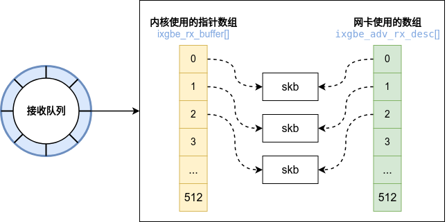

通常来说如下代码在网络通信中用于接收对端的数据:

```c
int main() {
    int sock = socket(AF_INET, SOCK_STREAM, 0);
    connect(sock, ...);
    read(sock, buffer, sizeof(buffer) - 1);
    ...
}
```

上述流程从用户态的角度来说比较简单，但是其背后涉及到了内核、网卡驱动等一列复杂的处理流程。本文以`linux-5.10.194`以及`ixgbe`网卡来阐述此流程。

## Linux网络收包概述

以`Linux`的视角看`TCP/IP`的网络分层模型如下图所示：

<div align=center></div>

`Linux`内核主要实现传输层和网络层，网卡驱动实现链路层。当网卡设备上有数据到达时，会给`CPU`的相关引脚触发一个电压变化，以通知`CPU`来处理数据；此种方式被称为中断。中断分为上半部和下半部：

- 上半部：只进行最简单的动作，快速处理然后释放`CPU`。

- 下半部：中断中剩下的大部分工作都由下半部继续处理。

`Linux`对于中断下半部的实现方式是软中断，由`ksoftirqd`内核线程全权处理。硬中断是通过给`CPU`物理引脚施加电压变化实现的，而软中断是通过给内存中的一个变量赋予二进制值以标记有软中断发生。

如下图总结了内核收包的路径图：


流程如下：

1. 数据帧从外部网络到达网卡。

2. 网卡收到数据，以`DMA`的方式把网卡收到的数据帧写到内存里。

3. 网卡向`CPU`发起一个中断，以通知`CPU`有数据到达。

4. `CPU`收到中断请求，调用网卡驱动注册的中断处理函数简单处理然后发出软中断，并快速释放`CPU`。

5. `ksoftirqd`内核线程检测到有软中断请求到达，调用`poll`开始轮询收包，最后交由各级协议栈处理。

## Linux启动

在真正能处理外部数据帧之前，内核协议栈、网卡驱动需要做很多的准备工作。

### 创建ksoftirqd内核线程

`Linux`内核中的软中断都是在内核线程`ksoftirqd`中进行的。系统上`ksoftirqd`线程的数等于`CPU`的数量(可以使用`ps -ef | grep ksoftirqd`查看)。

在`Linux`系统初始化的时候调用`early_initcall(spawn_ksoftirqd)`来创建`ksoftirqd`内核线程。关于`early_initcall`的机制请参考[Linux的initcall机制](https://zhuanlan.zhihu.com/p/627521955)，此处不做详细说明。`spawn_ksoftirqd`函数流程如下:

```c
static __init int spawn_ksoftirqd(void)
{
    cpuhp_setup_state_nocalls(CPUHP_SOFTIRQ_DEAD, "softirq:dead", NULL,
                  takeover_tasklets);
    BUG_ON(smpboot_register_percpu_thread(&softirq_threads));

    return 0;
}
early_initcall(spawn_ksoftirqd);
```

可以看到`spawn_ksoftirqd`将`softirq_threads`结构体以地址的形式传入`smpboot_register_percpu_thread`。如下所示为相关的代码：

```c
static struct smp_hotplug_thread softirq_threads = {
    .store            = &ksoftirqd,
    .thread_should_run    = ksoftirqd_should_run,
    .thread_fn        = run_ksoftirqd,
    .thread_comm        = "ksoftirqd/%u",
};
```

```c
/**
 * smpboot_register_percpu_thread - Register a per_cpu thread related
 *                         to hotplug
 * @plug_thread:    Hotplug thread descriptor
 *
 * Creates and starts the threads on all online cpus.
 */
int smpboot_register_percpu_thread(struct smp_hotplug_thread *plug_thread)
{
    unsigned int cpu;
    int ret = 0;

    get_online_cpus();
    mutex_lock(&smpboot_threads_lock);
    for_each_online_cpu(cpu) {
        ret = __smpboot_create_thread(plug_thread, cpu);
        if (ret) {
            smpboot_destroy_threads(plug_thread);
            goto out;
        }
        smpboot_unpark_thread(plug_thread, cpu);
    }
    list_add(&plug_thread->list, &hotplug_threads);
out:
    mutex_unlock(&smpboot_threads_lock);
    put_online_cpus();
    return ret;
}
EXPORT_SYMBOL_GPL(smpboot_register_percpu_thread);
```

可以看到`smpboot_register_percpu_thread`会为每个`online CPU`创建对应的`ksoftirqd`内核线程，进入线程循环函数`ksoftirqd_should_run`和`run_ksoftirqd`。需要注意的是软中断不仅有网络软中断，还包括其他类型，参考如下：

```c
enum
{
    HI_SOFTIRQ=0,
    TIMER_SOFTIRQ,
    NET_TX_SOFTIRQ,
    NET_RX_SOFTIRQ,
    BLOCK_SOFTIRQ,
    IRQ_POLL_SOFTIRQ,
    TASKLET_SOFTIRQ,
    SCHED_SOFTIRQ,
    HRTIMER_SOFTIRQ,
    RCU_SOFTIRQ,    /* Preferable RCU should always be the last softirq */

    NR_SOFTIRQS
};
```

### 网络子系统初始化

在网络子系统的初始化过程中，会为每个`CPU`初始化`softnet_data`，也会为`NET_RX_SOFTIRQ`和`NET_RX_SOFTIRQ`注册处理函数，流程如下图所示：


从上图可知网络子系统的初始化由`net_dev_init`函数完成，该函数主要完成:

- 为每一个`CPU`申请一个`softnet_data`数据结构，这个数据结构里的`poll_list`用于等待驱动程序将其`poll`函数注册进来。

- 通过`open_softirq`为`NET_RX_SOFTIRQ`以及`NET_RX_SOFTIRQ`分别注册处理函数`net_rx_action`和`net_tx_action`。

如下所示为相关代码：

```c
static int __init net_dev_init(void)
{
    ...
    for_each_possible_cpu(i) {
        struct work_struct *flush = per_cpu_ptr(&flush_works, i);
        // 为当前cpu创建softnet_data数据
        struct softnet_data *sd = &per_cpu(softnet_data, i);

        INIT_WORK(flush, flush_backlog);

        skb_queue_head_init(&sd->input_pkt_queue);
        skb_queue_head_init(&sd->process_queue);
#ifdef CONFIG_XFRM_OFFLOAD
        skb_queue_head_init(&sd->xfrm_backlog);
#endif
        // 注册poll_list
        INIT_LIST_HEAD(&sd->poll_list);
        sd->output_queue_tailp = &sd->output_queue;
#ifdef CONFIG_RPS
        sd->csd.func = rps_trigger_softirq;
        sd->csd.info = sd;
        sd->cpu = i;
#endif

        init_gro_hash(&sd->backlog);
        sd->backlog.poll = process_backlog;
        sd->backlog.weight = weight_p;
    }
    ...
    // 注册net_tx_action
    open_softirq(NET_TX_SOFTIRQ, net_tx_action);
    // 注册net_rx_action
    open_softirq(NET_RX_SOFTIRQ, net_rx_action);
    ...
    return rc;
}
subsys_initcall(net_dev_init);
```

通过`open_softirq`可以发现，软中断处理函数最终记录在`softirq_vec`变量里，后面`ksoftirqd`线程收到软中断的时候，也会使用`softirq_vec`变量来找到每一种软中断所对应的处理函数：

```c
void open_softirq(int nr, void (*action)(struct softirq_action *))
{
    softirq_vec[nr].action = action;
}
```

`softirq_vec`变量定义如下:

```c
static struct softirq_action softirq_vec[NR_SOFTIRQS] __cacheline_aligned_in_smp;
```

可以看到`softirq_vec`其实就是结构体`struct softirq_action`组成的数组。一个`struct softirq_action`表示某一类型的软中断处理函数：

```c
struct softirq_action
{
    void    (*action)(struct softirq_action *);
};
```

### 协议栈注册

内核实现了网络层的`IP`协议，也实现了传输层的`TCP`协议和`UDP`协议。内核通过`fs_initcall`调用`inet_init`来完成协议栈的一系列初始化：

- 注册协议栈各层的处理函数。

- 添加主要的协议。

- 初始化各层协议。

具体可参加如下图：


`tcp_prot`定义指定了`TCP`协议栈的接口函数，用户态的系统调用最终会调用到对应的如下函数：

```c
struct proto tcp_prot = {
	.name			= "TCP",
	.owner			= THIS_MODULE,
	.close			= tcp_close,
	.pre_connect		= tcp_v4_pre_connect,
	.connect		= tcp_v4_connect,
	.disconnect		= tcp_disconnect,
	.accept			= inet_csk_accept,
	.ioctl			= tcp_ioctl,
	.init			= tcp_v4_init_sock,
	.destroy		= tcp_v4_destroy_sock,
	.shutdown		= tcp_shutdown,
	.setsockopt		= tcp_setsockopt,
	.getsockopt		= tcp_getsockopt,
	.bpf_bypass_getsockopt	= tcp_bpf_bypass_getsockopt,
	.keepalive		= tcp_set_keepalive,
	.recvmsg		= tcp_recvmsg,
	.sendmsg		= tcp_sendmsg,
	.sendpage		= tcp_sendpage,
	.backlog_rcv		= tcp_v4_do_rcv,
	.release_cb		= tcp_release_cb,
	.hash			= inet_hash,
	.unhash			= inet_unhash,
	.get_port		= inet_csk_get_port,
	.enter_memory_pressure	= tcp_enter_memory_pressure,
	.leave_memory_pressure	= tcp_leave_memory_pressure,
	.stream_memory_free	= tcp_stream_memory_free,
	.sockets_allocated	= &tcp_sockets_allocated,
	.orphan_count		= &tcp_orphan_count,
	.memory_allocated	= &tcp_memory_allocated,
	.memory_pressure	= &tcp_memory_pressure,
	.sysctl_mem		= sysctl_tcp_mem,
	.sysctl_wmem_offset	= offsetof(struct net, ipv4.sysctl_tcp_wmem),
	.sysctl_rmem_offset	= offsetof(struct net, ipv4.sysctl_tcp_rmem),
	.max_header		= MAX_TCP_HEADER,
	.obj_size		= sizeof(struct tcp_sock),
	.slab_flags		= SLAB_TYPESAFE_BY_RCU,
	.twsk_prot		= &tcp_timewait_sock_ops,
	.rsk_prot		= &tcp_request_sock_ops,
	.h.hashinfo		= &tcp_hashinfo,
	.no_autobind		= true,
	.diag_destroy		= tcp_abort,
};
EXPORT_SYMBOL(tcp_prot);
```

`inet_add_protocol(&tcp_protocol, IPPROTO_TCP)`将`tcp_v4_rcv`注册到`inet_protos`数组中。当有`TCP`数据报文到达时，`ip`层会调用此`tcp_v4_rcv`用于接收数据报文。总的来看`inet_add_protocol`函数将`TCP`和`UDP`对应的数据报文接收函数注册到`inet_protos`数组中。

```c
int inet_add_protocol(const struct net_protocol *prot, unsigned char protocol)
{
	if (!prot->netns_ok) {
		pr_err("Protocol %u is not namespace aware, cannot register.\n",
			protocol);
		return -EINVAL;
	}

	return !cmpxchg((const struct net_protocol **)&inet_protos[protocol],
			NULL, prot) ? 0 : -1;
}
```

对于`IP`报文，函数`dev_add_pack(&ip_packet_type)`将`ip_rcv`注册到`ptype_base`哈希表中。当有`IP`报文到达时，调用`ip_rcv`进行处理。`ip_packet_type`定义如下，此处`type`定义为`#define ETH_P_IP 0x0800`：

```c
static struct packet_type ip_packet_type __read_mostly = {
	.type = cpu_to_be16(ETH_P_IP),
	.func = ip_rcv,
	.list_func = ip_list_rcv,
};
```

`dev_add_pack`函数实现如下：

```c
void dev_add_pack(struct packet_type *pt)
{
	struct list_head *head = ptype_head(pt);

	spin_lock(&ptype_lock);
	list_add_rcu(&pt->list, head);
	spin_unlock(&ptype_lock);
}
EXPORT_SYMBOL(dev_add_pack);
```

```c
static inline struct list_head *ptype_head(const struct packet_type *pt)
{
	if (pt->type == htons(ETH_P_ALL))
		return pt->dev ? &pt->dev->ptype_all : &ptype_all;
	else
		return pt->dev ? &pt->dev->ptype_specific :
				 &ptype_base[ntohs(pt->type) & PTYPE_HASH_MASK];
}
```

软中断通过`ptype_base`找到`ip_rcv`的函数地址，进而将`IP`报文正确的送到`ip_rcv`中执行。在`ip_rcv`中通过`inet_protos`找到`TCP`或者`UDP`的处理函数地址，然后把包转发给`tcp_v4_rcv`或者`udp_rcv`函数。

### 网卡驱动初始化

驱动程序使用`module_init`向内核注册一个初始化函数，当驱动程序被加载时，内核会调用这个函数。如下为`ixgbe`网卡定义的相关操作函数:

```c
static struct pci_driver ixgbe_driver = {
	.name      = ixgbe_driver_name,
	.id_table  = ixgbe_pci_tbl,
	.probe     = ixgbe_probe,
	.remove    = ixgbe_remove,
	.driver.pm = &ixgbe_pm_ops,
	.shutdown  = ixgbe_shutdown,
	.sriov_configure = ixgbe_pci_sriov_configure,
	.err_handler = &ixgbe_err_handler
};
```

当内核加载`ixgbe`网卡驱动时，会调用`ixgbe_init_module`:

```c
/**
 * ixgbe_init_module - Driver Registration Routine
 *
 * ixgbe_init_module is the first routine called when the driver is
 * loaded. All it does is register with the PCI subsystem.
 **/
static int __init ixgbe_init_module(void)
{
	int ret;
	...
	ixgbe_wq = create_singlethread_workqueue(ixgbe_driver_name);
	...
	ret = pci_register_driver(&ixgbe_driver);
    ...
#ifdef CONFIG_IXGBE_DCA
	dca_register_notify(&dca_notifier);
#endif

	return 0;
}

module_init(ixgbe_init_module);
```

`ixgbe_init_module`调用`pci_register_driver(&ixgbe_driver)`后，内核就知道`ixgbe`网卡驱动的`ixgbe_driver_name`和`ixgbe_probe`等函数地址以及其他一些驱动信息。网卡驱动被识别后，内核会调用其`probe`方法(`ixgbe_probe`)让网卡设备处于就绪状态。对于`ixgbe`网卡，其`ixgbe_probe`位于`drivers/net/ethernet/intel/ixgbe/ixgbe_main.c`。加载`ixgbe`网卡驱动时函数`ixgbe_probe`主要操作如下所示：


**dma_set_mask_and_coherent**

`dma_set_mask_and_coherent`函数设置`ixgbe`网卡的`DMA`属掩码和一致性属性。

**alloc_etherdev_mq**

- 分配`struct net_device`结构体指针。

- 设置相关的回调函数。

- 初始化分配的`struct net_device`结构体指针某些字段。

**netdev->netdev_ops = &ixgbe_netdev_ops**

注册`ixgbe`网卡设备的操作函数：

```c
static const struct net_device_ops ixgbe_netdev_ops = {
	.ndo_open		= ixgbe_open,
	.ndo_stop		= ixgbe_close,
	.ndo_start_xmit		= ixgbe_xmit_frame,
	.ndo_set_rx_mode	= ixgbe_set_rx_mode,
	.ndo_validate_addr	= eth_validate_addr,
	.ndo_set_mac_address	= ixgbe_set_mac,
	.ndo_change_mtu		= ixgbe_change_mtu,
	.ndo_tx_timeout		= ixgbe_tx_timeout,
	.ndo_set_tx_maxrate	= ixgbe_tx_maxrate,
	.ndo_vlan_rx_add_vid	= ixgbe_vlan_rx_add_vid,
	.ndo_vlan_rx_kill_vid	= ixgbe_vlan_rx_kill_vid,
	.ndo_do_ioctl		= ixgbe_ioctl,
	.ndo_set_vf_mac		= ixgbe_ndo_set_vf_mac,
	.ndo_set_vf_vlan	= ixgbe_ndo_set_vf_vlan,
	.ndo_set_vf_rate	= ixgbe_ndo_set_vf_bw,
	.ndo_set_vf_spoofchk	= ixgbe_ndo_set_vf_spoofchk,
	.ndo_set_vf_rss_query_en = ixgbe_ndo_set_vf_rss_query_en,
	.ndo_set_vf_trust	= ixgbe_ndo_set_vf_trust,
	.ndo_get_vf_config	= ixgbe_ndo_get_vf_config,
	.ndo_get_stats64	= ixgbe_get_stats64,
	.ndo_setup_tc		= __ixgbe_setup_tc,
#ifdef IXGBE_FCOE
	.ndo_select_queue	= ixgbe_select_queue,
	.ndo_fcoe_ddp_setup = ixgbe_fcoe_ddp_get,
	.ndo_fcoe_ddp_target = ixgbe_fcoe_ddp_target,
	.ndo_fcoe_ddp_done = ixgbe_fcoe_ddp_put,
	.ndo_fcoe_enable = ixgbe_fcoe_enable,
	.ndo_fcoe_disable = ixgbe_fcoe_disable,
	.ndo_fcoe_get_wwn = ixgbe_fcoe_get_wwn,
	.ndo_fcoe_get_hbainfo = ixgbe_fcoe_get_hbainfo,
#endif /* IXGBE_FCOE */
	.ndo_set_features = ixgbe_set_features,
	.ndo_fix_features = ixgbe_fix_features,
	.ndo_fdb_add		= ixgbe_ndo_fdb_add,
	.ndo_bridge_setlink	= ixgbe_ndo_bridge_setlink,
	.ndo_bridge_getlink	= ixgbe_ndo_bridge_getlink,
	.ndo_dfwd_add_station	= ixgbe_fwd_add,
	.ndo_dfwd_del_station	= ixgbe_fwd_del,
	.ndo_udp_tunnel_add	= udp_tunnel_nic_add_port,
	.ndo_udp_tunnel_del	= udp_tunnel_nic_del_port,
	.ndo_features_check	= ixgbe_features_check,
	.ndo_bpf		= ixgbe_xdp,
	.ndo_xdp_xmit		= ixgbe_xdp_xmit,
	.ndo_xsk_wakeup         = ixgbe_xsk_wakeup,
};
```

**ixgbe_set_ethtool_ops**

设置`ixgbe`网卡的`ethtool`回调函数：

```c
void ixgbe_set_ethtool_ops(struct net_device *netdev)
{
	netdev->ethtool_ops = &ixgbe_ethtool_ops;
}
```

`ixgbe_ethtool_ops`结构体定义如下：

```c
static const struct ethtool_ops ixgbe_ethtool_ops = {
	.supported_coalesce_params = ETHTOOL_COALESCE_USECS,
	.get_drvinfo            = ixgbe_get_drvinfo,
	.get_regs_len           = ixgbe_get_regs_len,
	.get_regs               = ixgbe_get_regs,
	.get_wol                = ixgbe_get_wol,
	.set_wol                = ixgbe_set_wol,
	.nway_reset             = ixgbe_nway_reset,
	.get_link               = ethtool_op_get_link,
	.get_eeprom_len         = ixgbe_get_eeprom_len,
	.get_eeprom             = ixgbe_get_eeprom,
	.set_eeprom             = ixgbe_set_eeprom,
	.get_ringparam          = ixgbe_get_ringparam,
	.set_ringparam          = ixgbe_set_ringparam,
	.get_pause_stats	= ixgbe_get_pause_stats,
	.get_pauseparam         = ixgbe_get_pauseparam,
	.set_pauseparam         = ixgbe_set_pauseparam,
	.get_msglevel           = ixgbe_get_msglevel,
	.set_msglevel           = ixgbe_set_msglevel,
	.self_test              = ixgbe_diag_test,
	.get_strings            = ixgbe_get_strings,
	.set_phys_id            = ixgbe_set_phys_id,
	.get_sset_count         = ixgbe_get_sset_count,
	.get_ethtool_stats      = ixgbe_get_ethtool_stats,
	.get_coalesce           = ixgbe_get_coalesce,
	.set_coalesce           = ixgbe_set_coalesce,
	.get_rxnfc		= ixgbe_get_rxnfc,
	.set_rxnfc		= ixgbe_set_rxnfc,
	.get_rxfh_indir_size	= ixgbe_rss_indir_size,
	.get_rxfh_key_size	= ixgbe_get_rxfh_key_size,
	.get_rxfh		= ixgbe_get_rxfh,
	.set_rxfh		= ixgbe_set_rxfh,
	.get_eee		= ixgbe_get_eee,
	.set_eee		= ixgbe_set_eee,
	.get_channels		= ixgbe_get_channels,
	.set_channels		= ixgbe_set_channels,
	.get_priv_flags		= ixgbe_get_priv_flags,
	.set_priv_flags		= ixgbe_set_priv_flags,
	.get_ts_info		= ixgbe_get_ts_info,
	.get_module_info	= ixgbe_get_module_info,
	.get_module_eeprom	= ixgbe_get_module_eeprom,
	.get_link_ksettings     = ixgbe_get_link_ksettings,
	.set_link_ksettings     = ixgbe_set_link_ksettings,
};
```

如果使用`ethtool`命令对`ixgbe`网卡进行操作，最终会调用到`ixgbe_set_ethtool_ops`函数注册的回调函数上。因此，当使用`ethtool`命令查看网卡收发包统计、调整网卡`RX`队列的数量和大小是因为`ethtool`命令最终调用可网卡驱动的相应方法。

**eth_platform_get_mac_address**

`eth_platform_get_mac_address`函数获取网卡设备的`MAC`地址，并填充到`netdev->dev_addr`中。

**ixgbe_init_interrupt_scheme**

此函数负责初始化`ixgbe`网卡的中断方案。对于网卡设备来说正确初始化中断是及其重要的。如下所示为`ixgbe_init_interrupt_scheme`函数的调用关系图：


可以看到`ixgbe_init_interrupt_scheme`最终会调用到``函数：

```c
/* initialize NAPI */
netif_napi_add(adapter->netdev, &q_vector->napi,
		       ixgbe_poll, 64);
```

`netif_napi_add`函数注册一个`NAPI`机制必须的函数。对于`ixgbe`网卡来说，这个函数是`ixgbe_poll`，用于轮询网卡接收队列，处理接收到的数据包。

### 启动网卡

上面的初始化流程都完成以后，就可以启动网卡了。在[`网卡驱动初始化`](#网卡驱动初始化)中注册了`ixgbe`网卡设备的操作函数，包含了网卡启用、发包、设置`MAC`地址等回调函数。

```c
static const struct net_device_ops ixgbe_netdev_ops = {
    .ndo_open		= ixgbe_open,
	.ndo_stop		= ixgbe_close,
	.ndo_start_xmit		= ixgbe_xmit_frame,
	.ndo_set_rx_mode	= ixgbe_set_rx_mode,
	.ndo_validate_addr	= eth_validate_addr,
    ...
}
```

当执行`ifconfig enp97s0f0 up`时，`net_device_ops`变量中的`ndo_open`函数会被调用。对于`ixgbe`网卡而言，最终调用的是`ixgbe_open`方法：

```c
/**
 * ixgbe_open - Called when a network interface is made active
 * @netdev: network interface device structure
 *
 * Returns 0 on success, negative value on failure
 *
 * The open entry point is called when a network interface is made
 * active by the system (IFF_UP).  At this point all resources needed
 * for transmit and receive operations are allocated, the interrupt
 * handler is registered with the OS, the watchdog timer is started,
 * and the stack is notified that the interface is ready.
 **/
int ixgbe_open(struct net_device *netdev)
{
    ...
	netif_carrier_off(netdev);

	/* allocate transmit descriptors */
    // 分配了RingBuffer，并建立内存和Tx队列的映射关系
	err = ixgbe_setup_all_tx_resources(adapter);
    ...
	/* allocate receive descriptors */
    // 分配了RingBuffer，并建立内存和Rx队列的映射关系
	err = ixgbe_setup_all_rx_resources(adapter);
	if (err)
		goto err_setup_rx;

	ixgbe_configure(adapter);
    // 注册中断处理函数
	err = ixgbe_request_irq(adapter);
	if (err)
		goto err_req_irq;

	/* Notify the stack of the actual queue counts. */
	queues = adapter->num_tx_queues;
	err = netif_set_real_num_tx_queues(netdev, queues);
    ...
	queues = adapter->num_rx_queues;
	err = netif_set_real_num_rx_queues(netdev, queues);
    ...
    // ixgbe_up_complete->ixgbe_napi_enable_all->napi_enable启用NAPI
	ixgbe_up_complete(adapter);
    ...
}
```

**ixgbe_setup_all_rx_resources**

在`ixgbe_open`中调用`ixgbe_setup_all_rx_resources`分配`RingBuffer`，并建立与内存的映射关系:

```c
/**
 * ixgbe_setup_all_rx_resources - allocate all queues Rx resources
 * @adapter: board private structure
 *
 * If this function returns with an error, then it's possible one or
 * more of the rings is populated (while the rest are not).  It is the
 * callers duty to clean those orphaned rings.
 *
 * Return 0 on success, negative on failure
 **/
static int ixgbe_setup_all_rx_resources(struct ixgbe_adapter *adapter)
{
	int i, err = 0;

	for (i = 0; i < adapter->num_rx_queues; i++) {
		err = ixgbe_setup_rx_resources(adapter, adapter->rx_ring[i]);
		...
	}
    ...
}
```

上面的循环中，创建了若干个发送队列和接收队列。下图所示为接收队列，发送队列类似。


接下来看看每一个队列是如何创建出来的：

```c
/**
 * ixgbe_setup_rx_resources - allocate Rx resources (Descriptors)
 * @adapter: pointer to ixgbe_adapter
 * @rx_ring:    rx descriptor ring (for a specific queue) to setup
 *
 * Returns 0 on success, negative on failure
 **/
int ixgbe_setup_rx_resources(struct ixgbe_adapter *adapter,
			     struct ixgbe_ring *rx_ring)
{
	...
    // ixgbe_rx_buffer的size
	size = sizeof(struct ixgbe_rx_buffer) * rx_ring->count;

	if (rx_ring->q_vector)
		ring_node = rx_ring->q_vector->numa_node;
    // 分配ixgbe_rx_buffer队列内存
	rx_ring->rx_buffer_info = vmalloc_node(size, ring_node);
	...
	/* Round up to nearest 4K */
    // 分配ixgbe_adv_rx_desc队列内存
	rx_ring->size = rx_ring->count * sizeof(union ixgbe_adv_rx_desc);
	rx_ring->size = ALIGN(rx_ring->size, 4096);
	set_dev_node(dev, ring_node);
	rx_ring->desc = dma_alloc_coherent(dev,
					   rx_ring->size,
					   &rx_ring->dma,
					   GFP_KERNEL);
	...
    // 初始化队列成员
	rx_ring->next_to_clean = 0;
	rx_ring->next_to_use = 0;
    ...
}
```

通过上述代码可以看到，实际上一个`rx_ring`内部有两个环形队列，如下图所示：

- **ixgbe_rx_buffer**数组：这个数组是内核使用，通过`vmalloc_node`申请的。

- **ixgbe_adv_rx_desc**：这个数组是网卡硬件使用的，通过`dma_alloc_coherent`分配。



**ixgbe_request_irq**

接下来使用`ixgbe_request_irq`注册中断:

```c
/**
 * ixgbe_request_irq - initialize interrupts
 * @adapter: board private structure
 *
 * Attempts to configure interrupts using the best available
 * capabilities of the hardware and kernel.
 **/
static int ixgbe_request_irq(struct ixgbe_adapter *adapter)
{
	...
	if (adapter->flags & IXGBE_FLAG_MSIX_ENABLED)
		err = ixgbe_request_msix_irqs(adapter);
	else if (adapter->flags & IXGBE_FLAG_MSI_ENABLED)
		err = request_irq(adapter->pdev->irq, ixgbe_intr, 0,
				  netdev->name, adapter);
	else
		err = request_irq(adapter->pdev->irq, ixgbe_intr, IRQF_SHARED,
				  netdev->name, adapter);
    ...
}
```

## 数据包到达

### 硬中断处理

数据报文从网线到达网卡上的时候，首先到达网卡的接收队列。网卡会在之前分配的`rx_ring_buffer`中寻找可用的内存，找到后直接将数据报文`DMA`到网卡之前关联的内存里。`DMA`操作完成后，网卡会向`CPU`发起一个硬中断，通知`CPU`有数据到达。中断的处理流程如下：
